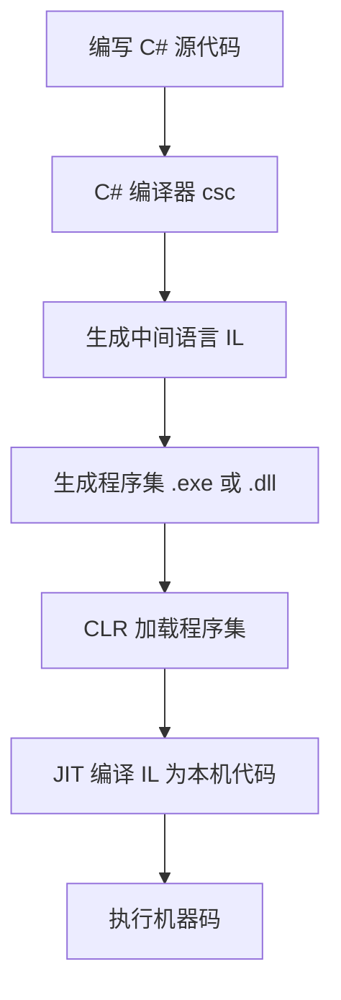

笔记.


# **C# 总结**


---
##  基础

###  visual studio 2022 
   - 	 https://visualstudio.microsoft.com/zh-hans/vs/
   - 安装 配置 基础信息  ildasm反编译工具
   - 	 创建项目后生成一个文件夹中各个文件的含义：
       .sln--解决方案文件   .csproj-项目文件    .cs--源文件   .config-配置文件   bin文件夹--可执行文件exe
       obj--中间目标文件   Properties文件夹--程序集信息文件AssemblyInfo.cs
#### vs2022常用快捷键
shift+tab	tab		shift+up/down 			ctrt+d			shift+ctrl+l		alt+up/down			ctrl+k+d	


反编译 ildasm	

###  .net 组成部分

#### .net 与.netframwork

​	.net是微软公司开发的跨平台、多编程语言的软件开发框架

​	.netframwork是.net的一部分

#### .netframwork：

1. 类库

   1. 框架类库FCL（FrameWork Class language）
   2. 基础类库 BCL （Base Class Library）包含我们在程序中用到的核心功能：命名空间、类、枚举、集合、文件io、线程、进程、反射、网络等
   
2. 公共语言运行时CLR  (Common Language Runtime)、

   微软中间语言MSIL  (Microsoft intermediate Language)：

   1. 实时编译 JIT （Just-In-Time）
   2. 垃圾回收 GC （**Garbage Collection**）
   3. 异常处理
   4. 内存管理
   5. 跨语言调试（为什么能做到，中间语言也有自己的规范：）
      - CTS:Common Type System:通用类型系统->解决不同语言的数据类型问题
      - CLS:Common Language Specification:公共语言规范->解决不同语言的语法规范问题

​	


### **C# 编译过程流程图**



---

## **1. 基础语法**

### **1.1 变量与数据类型**

#### 变量三要素：

​	定义、赋值、使用

#### 变量分类：

​	内存有四个区：堆、栈、静态区、常量区

##### **数值型**：在栈中

   栈中存的是简单数据

- 整型数值：

  - **有符号：有正数、负数** 

    sbyte(8位/1字节);  	short(16位/2字节);  	int(32位/4字节);   	long(64位/8个字节)

  - 无符号：**只有有正数**

       byte(8位/1字节); 	ushort(16位/2字节）	uint(32位/4字节) 	ulong(64位/8个字节	

- 浮点型数值：

  ​	float(32位/4字节)			单精度; 

  ​	double(64位/8字节)		   双精度;   

  ​	decimal(128位/16字节) 	    高精度适合财务计算; 

  

- bool布尔，(8位/1字节);  char字符(16位/2字节);  

- enum枚举,默认底层类型是 `int`;  可以通过显式指定底层类型来改变 `enum` 的大小

- struct结构体, 其大小取决于它的字段类型和内存对齐规则。

  

##### **引用类型**：在堆中

  堆中存的是复杂数据

- class 类 	  		  array 数组		delegate 委托  
- interface 接口	 	string 字符串    	dynamic 动态类


##### **隐式转换、变量常量**：

- 显示声明  int a=12;
- 隐式声明  var a=12;	
- 常量 const string str = "string";


##### **二进制、字节位数**：

###### 字节

1. 最小计算机存储单位为字节(bit)，一个字节有八位如（00000001）
2. 汉字两个字节，16位。
3. sizeof()//获取字节数
4. 位数是相对二进制来说的

###### 进制转换 

Convert.ToString() 可以快速转换   BitCovert 字节转换

```
二进制 ↔ 八进制     3位<->1位
二进制 ↔ 十六进制   4位<->1位
二进制 ↔ 十进制   每个位数的结果相加
```


### **1.2 运算符**
- **算术运算符**：`+`, `-`, `*`, `/`, `%`
- **比较运算符**：`==`, `!=`, `>`, `<`, `>=`, `<=`
- **逻辑运算符**：`&&条件与`, `||条件或`, `!逻辑非`，`& 逻辑与 AND`,`^逻辑异或`,`|逻辑或 OR `
- **赋值运算符**：`=`, `+=`, `-=`, `*=`, `/=`
- ++  --  区分前++ 后++ 的区别   --一样，前++先运算再取值，后++ 先取值后运算
- null 与布尔值逻辑运算
  - | x     | y     | x&y   | x\|y |
    | ----- | ----- | ----- | ---- |
    | true  | null  | null  | true |
    | false | null  | false | null |
    | null  | true  | null  | true |
    | null  | flase | false | null |

### **1.3 字符串**
- **注意**：尽管 string 为引用类型，但是定义相等运算符 == 和 != 是为了比较 string 对象（而不是引用）的值。
- 转义  \
- 拼接方式：
  ```csharp
	//1. 字符串内插 {<interpolationExpression 结果的表达式>[,<alignment 正数是右对齐；负数左对齐>][:<formatString 格式化方式>]}
	//2. @ 逐字字符串文本
	//3. """
  ```
- 跟StringBuilder区别：string会生成一个新的内存存储，StringBuilder是在堆上修改。

### **1.4 流程、分支、循环语句**
- **条件语句**：
  ```csharp
  //1.if else 	2. if elseif else 	3.switch case
  if (age > 18)
  {
      Console.WriteLine("Adult");
  }
  else
  {
      Console.WriteLine("Teenager");
  }
  ```

- **循环语句**：
  ```csharp
  //1.for  2.foreach   3.while	4.do while
  //await foreach
  //continue  break  return goto语句将控制权转交给带有标签的语句
  
  for(int i=0;i<length;i++){if(a==b){goto Found;}}
  Found:
  	Console.Write("2322")
  
  int a=0;
  while(a<9){ 
    a++
  }
  
  switch(xx){ case "":xx break;  default:break;}
  ```
### **1.5 方法**

#### 1. 方法定义

- 访问修饰符  public private  protect
- 返回类型：值类型、引用类型、void 无返回值类型

```C#
访问权限 返回值类型 方法名(形参列表)
{
	方法体语句;
}

class Count{
    public static int Add(int a, int b)
	{
		return a + b;
	}
 	public static int Other(int a, int b,params int[] c)
	{
		
	}
    
    // 乱写的案例
    public static void Test(){
        int a=1;
        int b=2;
        Add(a,b);
		Add(ref a,ref b);
        Add(out int 3,out int 5)
        Other(a,b,4,5,6);
        Other(a,b,new int[]{7,8,9});
    }
}
```

#### 2.形参ref、out、params：

​	ref(引用传递)、 out(返回多个值)、 params(可变参数)、 默认参数(用=传递)

#### 3. 重载

**方法重载就是：方法的名称一样，但是方法签名不同**。 

方法签名由两部分组成：1.方法的形参列表 2.方法的名称 

如果方法名一致，只要方法的形参列表不完全一致，编译器就会认为这是不同的方法签名。编译器会根 据输入的参数去调用不同方法

##### 3.1 普通重载：

```C#
class Count{
    public static int Add(int a, int b)
	{
		return a + b;
	}
	public static int Add(string a, string b)
	{
		return Convert.ToInt32(a) + Convert.ToInt32(b);
	}
    
    public static void Test(){
        Add(1,2)
		Add("1","2")
    }
}
```

##### 3.2 运算符重载 operator：

```C#
class Point{
	public double X { get; set; }
	public double Y { get; set; }
	public Point(double x, double y)
	{
		X = x;
		Y = y;
	}

    public static Point operator +(Point point1, Point point2){
		return new Point(point1.X + point2.X, point1.Y + point2.Y);
	}
}


...
Point point1 = new Point(1, 2);
Point point2 = new Point(3, 4);
//调用运算符重载：+
Point point3 = point1 + point2;
...  
```

###### 3.2-1注意点：

可以重载的运算符
- 算术运算符 | \+ 、 - 、 * 、 / 、 ++ 、 --   |
- 关系运算符 | \> 、 < 、 >= 、 <= 、 == 、 != |
- 逻辑运算符 | & 、\|、！、^                   |
-  位运算符   | ~                               |

1. .不可以被重载运算符有:赋值运算符[ = ],逻辑运算符中的[ && 、 || ]
2. 关系运算符如果想重载，那么必须要**成对的重载**，例如重载了 > ，则必须重载 <；有==就一定要有!=

#### 4.递归：
自己调用自己，记得退出条件


------


## **2 各种数据操作**

### **2.1 String常用函数**

- Length 获取字符串长度
- `+`  连接字符串     `+`多次拼接效率低，大文本用`StringBuilder` 
- public char this[int index] { get; }  直接用索引获取字符 
- Substring(int start, [int length])  截取字符串
- Split(params char[]) 分割 分隔符分割为字符串数组
- String.Join(string separator, IEnumerable<string>) 联结 常用于数组转字符串
- Replace(old, new) 替换字符串内容 **区分大小写**
- `String.Format(string format, params object[] args)`(静态)  | 格式化字符串 使用`{0:C}`等占位符
- `Trim()` / `TrimStart()` / `TrimEnd()`  去空格 去除首尾空白字符
- `Contains(string)` 包含 判断是否包含子串
- `StartsWith` / `EndsWith` 查找开头/结尾匹配
- Compare()/ Equals()  比较  参数规则都很多
- `IndexOf` / `LastIndexOf` 查找字符/子串位置           未找到时返回-1
- `ToUpper()` / `ToLower()` 转全大写/全小写
- `ToString()`  类型转换 转为字符串（所有类型通用）
- String.IsNullOrEmpty(String)  是否为null或空
- String.IsNullOrWhiteSpace(String)  是否为null或空格


### 2.2 StringBuilder

- Append 添加字符串
- Insert 插入字符串
- Remove  移除字符串
- Replace 替换字符串
- Clear 清空
- Equals 比较
- ToString 转换为String


### **2.3  enum 枚举**
- GetValues() 列举元素
- GetNames() 列举名称
- 其他转换如下：

```csharp
public enum Weak{一,二,三,四,五,六,日}
//取值
Weak day = 周.二;
Console.WriteLine(day);

// 遍历
foreach (Weak i in Enum.GetValues(typeof(Weak))){Console.WriteLine(i);}
foreach (string i in Enum.GetNames(typeof(Weak))){Console.WriteLine(i);}
for (int i = 0; i < 7; i++){
     Weak dayofWeek = (Weak)i;
     Console.WriteLine(dayofWeek);
 }

//枚举转字符串
string dayOfWeek2 = day.ToString();
Console.WriteLine(dayOfWeek2);

//字符串转枚举
string dayofWeek2 = "四";
Weak dayOfWeek4 = (Weak)Enum.Parse(typeof(Weak), dayOfWeek2);
Console.WriteLine(dayofWeek2);
```

### **2.4 struct 结构体**
1. 结构体是值类型  用struct修饰 ，类是引用类型  用class修饰
2. 结构体中的成员（字段，属性）在定义的时候不能直接赋值(常量除外)，类的成员在定义的时候是可以直接赋值的
3. 结构体也有一个默认无参构造方法，但是这个构造方法不能被覆盖的，你在定义结构体的构造方法的时候必须是有参的，而且必须全部对结构体的字段和属性赋值，类的默认无参构造方法是可以被覆盖的
4. 结构体在定义的变量的时候，你如果访问的是字段，你可以直接定义变量后调用。如果其它成员最好new   
当你new的时候，还是栈中开启内存，并且调用结构体的构造方法 ，类实例化必须new 堆中开启
5. 结构体不能有析构方法  
7. 结构体是不能继承结构体的，结构体不能继承类，但是可以继承接口（多个接口），类可以继承类，类不能继承结构体，类可以继承接口（多个） 
8.  partial同样可以修饰结构体 sealed不能修饰结构体，static不能修饰结构体但是可以修饰结构体成员
9.  结构体变量作为索引器或者属性的时候，不能对成员直接赋值

```csharp
public struct Person
{
    public string _name;
    public int _age{get;set;};
    public void _print(){Console.WriteLine("haha")};
}

Person p1 = new Person();
p1._name = "张三";
p1._age = 18;
p1._print();
```
### **2.5 日期与时间操作 (System.DateTime)**
- `DateTime.Now`  获取当前时间
- `DateTime.Parse(string)`   解析时间
- `ToString("yyyy-MM-dd HH:mm:ss")` 格式化输出


```csharp
// 格式化日期时间示例
DateTime now = DateTime.Now;
string timestamp = now.ToString("yyyy-MM-dd HH:mm:ss.fff"); // 带毫秒时间戳

// 计算时间差示例
DateTime start = DateTime.UtcNow;
// （业务操作...）
TimeSpan duration = DateTime.UtcNow - start;
Console.WriteLine($"耗时：{duration.TotalMilliseconds}ms");
```

---

### **2.6 随机数生成 (System.Random)**
- `Random.Next()` 生成非负随机整数 （0~`Int32.MaxValue-1`）
- `Random.Next(maxValue)` 生成[0, maxValue)
- `Random.Next(minValue, maxValue)` 生成指定区间的整数 包含min，不包含max 

```c#
// 生成6位随机验证码
Random rand = new Random();
string code = rand.Next(100000, 999999).ToString();
```


### **2.7 数学操作 (System.Math)**
- `Abs(x)` 绝对值
- `Sign(x)`   返回数值符号（-1,0,1）
- `Max(a,b)` / `Min(a,b)`  返回两者较大/较小值
- `Pow(x, y)` 计算x的y次方 
- `Sqrt(x)` 平方根
- `Log(x)` / `Log10(x)`  | 自然对数/以10为底的对数
- `Sin(x)` / `Cos(x)` / `Tan(x)` | 三角函数计算
- `Asin(x)` / `Acos(x)` / `Atan(x)` | 反三角函数
- `Round(x, [digits])`   | 四舍五入（可指定小数位）
- `Truncate(x)`          | 截断小数部分  

**现代数学运算** → 对于复杂计算推荐使用 `System.Numerics` 命名空间中的类型（如`Vector3`）


### **2.8 数组**

#### 1 定长数组
- `new T[size]`            | 声明固定大小数组 
-  `Length` / `GetLength(n)` | 获取数组长度/多维长度  
-  `Copy(Array source, Array dest, int length)` | 复制数组元素  可直接内存复制，效率高 
-  `Reverse()`              | 反转数组元素顺序                         | 支持部分区间反转
-  `Sort()`                 | 数组排序
-  `IndexOf` / `LastIndexOf` | 查找元素索引
-  `Exists` / `Find` / `FindAll` (需`using System.Collections.Generic`) | 条件查找元素              | 使用委托/Predicate                 
-   `ToArray()` (LINQ扩展方法) | 其他集合转数组          需引入`System.Linq

```csharp
int[] A; 
A = new int[3] { 1, 2, 3 };//定义数组长度，并对数组的每一个元素进行赋值

//数组声明:第二种方式
int[] B = new int[3];//定义数组长度，并对数组的每一个元素进行赋值
B[0] = 1;

//数组声明:第三种方式
int[] C = { 1, 2, 3 };

//多维数组
int[,] B = new int[3, 4];

//交错数组
int[][] E = new int[3][] { new int[] { 1, 2, 3 }, new int[] { 4, 5 }, new int[] {
6, 7, 8 } };

//Length 是所有的长度 GetLength
```

#### **2 List\<T\> 泛型数组**
-  **添加元素**   | `list.Add(4)`
-  **批量添加**   | `list.AddRange(new[] {4, 5})` 
-  **插入元素**   | `list.Insert(0, 0) → [0, 1, 2, 3]` 
-  **删除元素**   | `list.Remove(3)`
-  **查找元素**   | `list.Exists(x => x > 2)`<br>`list.Find(x => x % 2 == 0)<br/> IndexOf FindIndex FindLast FindAll` | 条件检查与元素查找
-  **清空**       | `list.Clear() `
-  **排序列表**   | `list.Sort() → [1, 2, 3]`
-  **批量删除**   | `list.RemoveAll(x => x > 2)`  
-  **列表转数组** | `int[] arr = list.ToArray()`
-  **切片**       | Slice (int start, int length)


常用属性：Capacity获取最大容量、Count获取当前元素个数、this[int Index]通过索引器访问元素

常用方法：Add、AddRange、Clear、Contains、Find、FindAll、IndexOf、Insert、InsertRange、ToArray

```csharp
List<string> fruits = new List<string> { "Apple", "Banana", "Cherry" };
fruits.Add("Orange");
Console.WriteLine(fruits[1]); // 输出 Banana
```

#### **3 ArrayList 集合**
-  **容量管理**   | `Capacity`                          | 获取或设置当前容量（初始默认 `4`，动态扩容时容量翻倍）。<br/>⚠️ 设置过小可能丢失数据，建议优先用 `TrimToSize`。 |
-  `TrimToSize()`                      | 将容量压缩到实际元素数量 `Count`。<br/>⚠️ 频繁调用可能降低性能。
-  **元素数量**   | `Count`   
-  **添加元素**   | `Add(object value)`⚠️ 值类型会**装箱**，需注意类型转换异常。
- `AddRange(ICollection c)`           | 批量添加集合元素。 
- `Insert(int index, object value)`   | 在指定位置插入元素。
- `Remove(object value)`              | 删除第一个匹配的元
- `RemoveAt(int index)`               | 删除指定位置的元素。<br/>⚠️ 越界会抛出 `ArgumentOutOfRangeException`。 
- `RemoveRange(int index, int count)` | 删除从指定位置开始的连续多个元素。
- `Clear()`                           | 清空所有元素（容量 `Capacity` 保持不变）   
- `Contains(object value)`            | 判断是否包含元素。
- `IndexOf(object value)`             | 返回第一个匹配元素
- `LastIndexOf(object value)`         | 返回最后一个匹配元素的索引。          
- `Sort()`                            | 对所有元素排序（依赖元素的 `IComparable` 接口）混合类型时可能抛出 `InvalidOperationException`。 
- `Sort(IComparer comparer)`          | 使用自定义比较器排序
- `Reverse()`                         | 反转所有元素的顺序。         
- `this[int index]`                   | 通过索引访问或修改元素。
- `ToArray()`                         | 转换为 `object[]` 数组。<br/>⚠️ 值类型元素需手动拆箱。
- `ToArray(Type type)`                | 转换为指定类型数组（如 `ToArray(typeof(int))`） 类型错误会抛出 `InvalidCastException`。
- `Clone()`                           | 浅拷贝创建一个新 `ArrayList`。   


常用属性：Capacity获取最大容量、Count获取当前元素个数、this[int Index]通过索引器访问元素

常用方法：Add、AddRange、Clear、Insert、Remove、RemoveAt

```csharp
List<string> fruits = new List<string> { "Apple", "Banana", "Cherry" };
fruits.Add("Orange");
Console.WriteLine(fruits[1]); // 输出 Banana
```


#### **4. 各个数组差异比较**

##### **1. 基本特性比较**
- **`int[]`** 数组是固定长度；**`List<T>`**可以自动扩容；**`ArrayList`**可以自动扩容
- **`ArrayList`**支持任意类型；**`int[]`** 、**`List<T>`** 只能约束的类型
- 都支持linq
- **`int[]`** 性能速度最快，**`ArrayList`**有装拆箱性能损耗

  

### **2.9 Dictionary字典**
- **添加键值对**         | `dict.Add("Key", 100)`<br>`dict["Key"] = 100`
- **删除键值对**         | `dict.Remove("Key")` 
- **检查包含键/值**      | `dict.ContainsKey("Key")`<br>`dict.ContainsValue(100)` 
- **安全获取值**         | `if (dict.TryGetValue("Key", out int val)) { ... }`
- **遍历字典**           | `foreach (var kvp in dict) { kvp.Key, kvp.Value }` 
- **字典转列表**         | `List<string> keys = dict.Keys.ToList();`
- **清空字典**           | `dict.Clear()`


```csharp
Dictionary<string, int> ages = new Dictionary<string, int>
{
    { "Alice", 25 },
    { "Bob", 30 }
};
Console.WriteLine(ages["Alice"]); // 输出 25
```

---
### **3.0 队列(Queue)操作**
- `Enqueue(T)`      | 入队（添加到队尾）
- `Dequeue()`       | 移除并返回队首元素  **队列为空时抛异常** 
- `Peek()`          | 查看队首元素但不移除
- `Count`           | 获取元素数量
- `Clear()`         | 清空队列
- `Contains(T)`     | 判断元素是否存在 
- `ToArray()`       | 将队列转为数组


1. **集合初始化语法** → `Queue<int> q = new Queue<int>(new[] {1,2,3});`
2. **数组与集合转换** → 使用LINQ提供的`ToList()`、`ToArray()`


### **3.1 栈 Stack&lt;T&gt;**
- `Push(T)`         | 入栈（添加到栈顶）
- `Pop()`           | 移除并返回栈顶元素                       | **栈为空时抛异常**   
- `Peek()`          | 查看栈顶元素但不移除             
- `Count`           | 获取元素数量                      
- `Clear()`         | 清空栈                          
- `Contains(T)`     | 判断元素是否存在                         | 效率为O(n)                   
- `ToArray()`       | 将栈转为数组                             | 元素顺序为出栈顺序（倒序） 


## **3. 面向对象编程**

### **1 类与对象**
#### **1.1类的定义**：

```csharp
访问权限 class 类名{
	类成员
}
```

#### **1.2类的实例化 **：

实例化的本质，其实一共就干了三件事情:

- 在堆中申请一块内存空间
- 在这块内存空间按照类的定义进行分配
- 调用类的构造函数

```csharp
语法定义格式：
类名 对象名 = new 类名()
Person person = new Person { Name = "Alice", Age = 30 };

在使用new的时候才会去开辟内存空间而且是在堆中申请的，类是引用类型：地址在栈上，内容在堆中。
```


#### 2 构造方法\函数：

##### 2.1定义：

​	在构建对象的时候，会自动调用的方法，所以叫构造方法。**构造方法可以有return也可以没有return，但不能返回值，构造方法时没有返回值的。**

​	

#### 3 this的作用：

1. 指向当前类的对象
2. 显式调用另外一个构造函数

```C#
class Person
{
	public string _name;
	public int _age;
	public string _address;

	public Person():this("小白",18)// 调用其他构造
	{
		Console.WriteLine("我是无参的构造函数：Person()");
	}
	public Person(string name,int age)
	{
		Console.WriteLine("我是有参构造函数：Person(string name,int age)");
		this._name = name;
		this._age = age;
	}
	public Person(string name, int age, string address) : this(name, age)
	{
		Console.WriteLine("我是有参构造函数：Person(string name, int age, string address)");
		_address = address;
	}
}
internal class Program
{
	static void Main(string[] args)
	{
		Person person1 = new Person();
		Person person2 = new Person("嘉嘉",18,"深圳市-龙华");
		Console.ReadKey();
	}
}
```


#### 4 析构方法/析构函数：

所谓的析构方法就是类对象，生命周期结束时。会自动调用的方法,**在类名前加波浪符号~**

```C#
public class TEST
{
	public TEST()
	{
		Console.WriteLine("默认无参构造函数");
	}
	~TEST()
	{
		Console.WriteLine("析构函数被调用");
	}
}
internal class Program
{
	static void Main(string[] args)
	{
		TEST test= new TEST();
	//Console.ReadKey();
	}
}
```


### **2 命名空间**

命名空间就是你要声明的命名空间名字。命名空间整格式是 using 命名空间;

#### 用法：

1. 同一命名空间下
2. 不同命名空间怎么引入


### **3 静态非静态**

#### static关键字：

​	修饰属性、方法、类

​	**核心点：**只要是被static所修饰的。**就会在启动的这个程序整个生命周期都是存在的**。会消耗大量的内存，影响程序的性能。

#### 注意点：

- 静态方法中只能调用静态的成员，不允许调用非静态的成员
- 静态构造函数只会被调用一次，在类的静态成员被调用的时候会至多触发一次
- 如果想在静态方法中调用非静态的字段就必须申请内存(new)，在通过对象访问成员。
- **静态类中的成员必须全部都是静态成员**。


### 4 类属性

#### get\set 取值赋值

- 自动属性：默认都有

```C#
class Person
{
	public string Name{get;set;}
}
```

- 只读、只写
```C#
class Person
{
	public string Name{get;}//只读
}
class Person
{
	public string Name{set;}//只写
}
```

- 操作：关键字value

  ```C#
  class Person
  {
  	 public string Name
   	{
       	get {
              //....do something
           	return Name;
      	}
       	set
       	{
           	//....do something
          	Name = value;
       	}
   }
  }
  ```

  

#### 索引器

**语法：**

```

访问权限 数据类型 this[[索引数据类型] 索引变量]
{
	get
	{
		return 变量;
	}
	set
	{
		变量=value;
	}
}
```

  ```C#
  class Person
  {
      char[] _show = { '就', '是', '有', '这', '种', '操', '作', '!' };
  	char[] _infoArray = { '鸡', '你', '太', '美', '！'};
  
  	 public char this[int type,int index] //可以指定任意类型字段
   	{
       	get {
             switch(type){
                 case 1:
                    // retrun _show[index]; //也可以做一些判断数组越界之类的
  					return index>_show.Length?"获取的数据超出范围": _show[index]
                 case 2:
                     retrun _infoArray[index];
             }
      	}
       	set
       	{
           	//....同上面
       	}
   }
  }
  //用法
  Person p1=new Person();
  p1[0,1]//取值
  p1[1,1]=xxx//赋值
  ```


### **5 分布类/部分类**

#### 关键字partial

```C#
//a 文件
partial class Person
{
	public string Name{
		get { return _name; }
		set { _name = value; }
	}
	public int Age;
}
//b 文件，可以不在不同地方同用一个类
partial class Person
{
	public  void getName(){
        return this._name;
    }
}
```

**注意点：**必须在同一命名空间下


### **6 类与成员的访问权限、行为修饰符**

#### **1. 访问修饰符**
-  **类访问权限**
| **修饰符**     | **范围**                                      | **示例**                           |
|----------------|----------------------------------------------|------------------------------------|
| `public`       | 任何代码均可访问                              | `public class MyClass { ... }`     |
| `internal` | 在本项目里面可以访问 | `internal class Helper`        |

-  **类成员访问权限**
| **修饰符**     | **范围**                                      | **示例**                           |
|----------------|----------------------------------------------|------------------------------------|
| `public`       | 任何代码均可访问                              | public string name; |
| `private`      | 仅定义该成员的类内部可用（默认类成员修饰符） | private int age; |
| `protected`    | 类内部及其派生类可用                          | protected string address; |
| `internal`     | 内部的，仅限于本类访问               | internal string PhoneNumber |
| `protected internal` | 同一程序集或派生类（逻辑或）            | protected internal string Email; |


#### **2. 类与成员行为修饰符**
| **修饰符** | **用途**                                   | **示例**                           |
| ---------- | ------------------------------------------ | ---------------------------------- |
| `sealed`   | 密封类，禁止类被继承或方法被重写           | `public sealed class FinalClass`   |
| `static`   | 定义静态类或成员（无需实例化直接调用）     | `public static class MathUtils`    |
| `abstract` | 定义抽象类或抽象方法                       | `public abstract class BaseModel`  |
| `virtual`  | 允许方法被子类重写                         | `public virtual void Calculate()`  |
| `override` | 重写基类虚方法或抽象方法                   | `public override void Calculate()` |
| `new`      | 隐藏基类同名成员                           | `public new void Execute()`        |
| `partial`  | 拆分类到多个文件（常用于自动生成代码扩展） | `public partial class DataModel`   |

### **7 只读 readonly**

定义类的成员   ---修饰字段（const也是修饰字段）
权限  readonly 类型名字  字段名=值;

对比const:
1 readony修饰在类中，const修饰可以在类中，也可以在main中（修饰局部变量）
2 它们都修饰字段 
3 const编译性常量  readonly 运行时常量（推荐使用--性能高点）
4 const修饰的字段定义的时候必须赋初始值，后面不能改。readonly 定义的时候可以赋值也可以不赋值，readonly修饰的字段可以在构造方法中再次修改一次，这里修改了后面就不能修改了
5 readonly可以static修饰的 ，但是如果你定义成静态的readonly，在构造方法初始化的话你必须在静态构造方法中初始化。const是不可以用static修饰


###  **8 继承（Inheritance）**

#### **1. 基本概念**
- **继承的本质**：子类（派生类）自动获取父类（基类）的 **字段、方法**（非私有成员），并可扩展或修改行为。
- **语法**：使用 `:` 符号声明继承关系。
```csharp
public class Animal  // 基类
{
    public string Name { get; set; }
    public void Eat() => Console.WriteLine("吃食物");
}

public class Dog : Animal  // 子类继承Animal
{
    public void Bark() => Console.WriteLine("汪汪！");
}

// 使用
var dog = new Dog();
dog.Eat();  // 继承自Animal类的方法
dog.Bark(); // Dog类自身的方法
```

#### **2. 继承链的规则**
- <u>**单根性**：C#不支持类的多继承（一个类只能有一个直接基类</u>）。重点核心
- **可传递性**：允许链式继承（如 `A → B → C`），C会有A的共有与受保护成员。
- **object类**：所有类的隐式基类（最终基类）。

#### **3. 构造函数的执行顺序**

##### 3.1 实例化子类的本质

基类构造函数优先执行（默认调用无参构造函数），也就是说会先构造父类然后才到子类。

##### 3.2 base的两个作用：

**1调用父类中的构造方法、2调用了父类的方法**

```csharp
public class Animal 
{
    public Animal(string name) => Name = name;
    public void Print(){Console.WriteLine("Animal")}
}

public class Dog : Animal 
{
    public Dog(string name, string breed) : base(name) // 1 传递name到基类构造函数
    {
        Breed = breed;
    }
    public void Print(){base.Print();};//2 调用了父类的方法
}
```

#### 4.**里氏转换**

如下面的例子：
```C#
class Friut{}
class Apple:Friut{
	public void AppleEat(){
        Console.WriteLine("我是苹果的吃法！");
    }
}
class Banana:Friut{
	public void BananaEat(){
        Console.WriteLine("我是香蕉的吃法！");
    }
}
```
##### 普通写法与里氏转换：

里氏转换：**父类可以装上一个子类对象，从而提高程序的拓展性**

```C#
//正常写法：需要每个子类都声明
Apple a=new Apple();
a.AppleEat();
Banana b=new Banana();
b.BananaEat();

//里氏转换方式
Friut[] friuts={new Apple(),new Banana()};
(Apple(friuts[0])).AppleEat();
(Banana(friuts[1])).BananaEat();
```

##### is关键字、as关键字

上面强制转换不优雅，用is或as关键来
```C#
foreach (var friut in friuts)
{
   //方式1 is关键字写法，并且赋值变量
   if (friut is Apple a){a.AppleEat();}
   if (friut is Banana b){b.BananaEat();}
    
   //方法2 as写法，as转换类型，如果转换不了就为null
   (friut as Apple)?.AppleEat();
   (friut as Banana)?.BananaEat();
}
```

---

### **9 多态性（Polymorphism）**

**多态性的本质**：实现与拓展不同的功能；子类（派生类）自动获取父类（基类）的 **字段、方法**（非私有成员），它允许将子类对象视为父类对象，从而在运行时确定具体调用哪个类的方法。

#### **1. 虚方法（Virtual Methods）**
- **用途**：允许子类重写父类方法实现。（**选择性**，可以重写可以不重写）
- **关键字**：`virtual`（父类声明方法）+ `override`（子类重写）。
```csharp
public class Animal 
{
    public virtual void MakeSound() => Console.WriteLine("默认声音");
}

public class Dog : Animal 
{
    public override void MakeSound() => Console.WriteLine("汪汪！");
}

// 使用多态
Animal animal = new Dog();
animal.MakeSound(); // 输出"汪汪！" （动态绑定）
```

#### **2. 抽象类、抽象方法（Abstract）**
- **抽象类**：不能被实例化，只能作为基类。（**强制性**）
- **抽象方法**：**仅定义签名，无实现**，必须被子类重写。
```csharp
public abstract class Shape 
{
    public abstract double GetArea();  // 抽象方法
}

public class Circle : Shape 
{
    public double Radius { get; set; }
    public override double GetArea() => Math.PI * Radius * Radius;
}
```

#### **3. 接口（Interfaces）**

- **与抽象类的区别**：接口只包含方法签名和属性，无实现，支持多重继承。 (**扩展性**)
- 可以很好的隔离不同类之间的联系，减少类和类之间耦合性
```csharp
public interface IFlyable 
{
    void Fly();  // 默认隐式为 public
}

public class Bird : Animal, IFlyable  // 多接口继承
{
    public void Fly() => Console.WriteLine("飞行中");
}
```

------

### **10 类的运算符重载**

#### 1. 运算符重载

​	查看方法的运算符重载，一样的。	

#### **2. implicit**隐式转换、explicit显式转换

下面是一个米--》千米，千米--》米的例子：

```C#
public class Meter
{
	public double Value { get; set; }
	public Meter(double value){Value = value;}
	//定义从Meter到Kilometer的隐式转换
    public static implicit operator Kilometer(Meter meter){
		return new Kilometer(meter.Value/1000.0);
	}
    //定义从Meter到Kilometer的显式转换
    public static explicit operator Kilometer(Meter meter){
		return new Kilometer(meter.Value/1000.0);
	}
}

public class KiloMeter
{
	public double Value { get; set; }
	public Meter(double value){Value = value;}
	//定义从Meter到Kilometer的隐式转换
    public static implicit operator Kilometer(Meter meter){
		return new Kilometer(meter.Value/1000.0);
	}
    //定义从Meter到Kilometer的显式转换
    public static explicit operator Kilometer(Meter meter){
		return new Kilometer(meter.Value/1000.0);
	}
}

Meter m=new Meter(1000);
KiloMeter km=m;// 隐式转换
KiloMeter km=(KiloMeter)m;// 显式转换

KiloMeter km=new KiloMeter(1);
Meter m=km;// 隐式转换
Meter m=(Meter)km;// 显式转换
```

------


### **11 装箱拆箱、泛型**

#### 1.装箱拆箱

所有类型的基类是object，也就是说object类可以转任意类型；
装箱: 将值类型转换为引用类型；拆箱: 将引用类型转换为值类型

```C#
//引用类型
object obj = null;
//值类型
int num = 10;
//装箱： 将值类型转换为引用类型
obj = num;
Console.WriteLine("装箱:" + obj);

//引用类型
object obj2 = 20;
//值类型
int num2;
//拆箱： 将引用类型转换为值类型
 num2 = (int)obj2;
Console.WriteLine("拆箱:" + num2);

```

##### 装拆箱的问题：
性能损耗太严重

```C#
object[] objArray = new object[100000000];
int[] intArray = new int[100000000];
Stopwatch sw = new Stopwatch();
sw.Start(); 
object obj = 1;
for (int i = 0; i < intArray.Length; i++)
{
    intArray[i] = (int)obj;//拆箱
}
sw.Stop();
Console.WriteLine("共消耗:{0}",sw.Elapsed);
```

#### 2.泛型
频繁装箱拆箱操作太损耗性能。但有些地方却又不能提前声明类型，这需要泛型。泛型可以把类型延迟到使用的时候注入。

##### 泛型约束
 泛型约束（where T : constraint）中的约束类型必须是接口、非密封类或者另一个类型参数.

```C#
class MyClass<T> where T : struct 
{
    // T 必须是值类型,只能限制到struct 这一层 
    //int、string、float、double些是密封类（通过使用sealed关键字），这意味着它不能被继承，因此不能被用作泛型约束
}

```

```C#
class TestClass<T, P>where T : class, new() where P : struct
 {
     public void Show(T t, P p)
     {
         Console.WriteLine("Hello, " + t.ToString() + " " + p.ToString());
     }
 }
```

##### 常用的约束：
1. **类型约束**（`where T : MyBaseClass`）
2. **接口约束**（`where T : IMyInterface`）
3. **值类型约束**（`where T : struct`）
4. **引用类型约束**（`where T : class`）
5. **无参构造函数约束**（`where T : new()`）
6. **多种约束**（`where T : MyBaseClass, IMyInterface, new()`）

#### 3 协变out、逆变in
**协变：IFoo<父类> = IFoo<子类>；** 本该** 输出** 传父类的地方传子类,** out 关键字** 
**逆变：IBar<子类> = IBar<父类>；**本该** 输入** 传子类的地方传父类，** in 关键字** 

**只能针对泛型接口或者委托**，**不能针对泛型类**

```C#
//协变 out 输出位置
    interface IFoo<out T> { T GetName(); }
    class Foo:IFoo<string>{
    	public string GetName(){return GetType().Name;}
    }
	....
	IFoo<string> fooStr=new Foo();
	IFoo<object> fooObj=fooStr;//
	Console.WriteLine(fooObj.GetName());  //因为要输出object类型，实际下会进行隐式转换：(Object)(new Foo().GetName())

//逆变  in  输入位置
    interface IBar<in T> { void Print(T Content); }
    class Bar:IBar<object>{
    	public void Print(object Content){Console.WriteLine(Content);}
    }
	....
	IBar<object> barObj=new Bar();
	IBar<string> barStr=barObj;//
	barStr.Print("haha");  //因为要输入object类型，实际下会对输入的字符串进行隐式转换：new Bar().Print((object)("haha"))
```

---

### **11 关键特性对比与陷阱**
#### **1. `override` vs `new`修饰符**
- **`override`**：完全替换基类方法（多态生效）。
- **`new`**：隐藏基类方法（若通过基类引用调用，仍执行基类版本）。
```csharp
public class Base 
{
    public void Show() => Console.WriteLine("Base");
}

public class Derived : Base 
{
    public new void Show() => Console.WriteLine("Derived"); // 隐藏而非重写
}

// 测试
Base obj = new Derived();
obj.Show(); // 输出"Base" （静态绑定）
```

#### **2. 抽象类 vs 接口**
| **特性**               | **抽象类**                          | **接口**                          |
|------------------------|-------------------------------------|-----------------------------------|
| 实现方法               | 可以包含具体方法                    | 默认无实现（C# 8开始支持默认实现）|
| 成员类型               | 可包含字段、构造函数                | 仅方法、属性、索引器、事件        |
| 多继承                 | 不支持                              | 支持多继承                        |
| 设计侧重点             | “是什么”（Is-a 关系）               | “能做什么”（行为契约）            |


---

## **5 异常处理**

### 5.1 **捕获异常**

```csharp
try
{
    int result = 10 / 0;
}
catch (DivideByZeroException ex)
{
    Console.WriteLine("Error: " + ex.Message);
}
finally
{
    Console.WriteLine("Finally block executed");
}
```
### 5.2 **抛出异常**
`throw new ArgumentException("invalid param");` 返回指定的异常类型和错误消息。
### 5.3 **自定义异常**
自定义异常类（继承 `Exception`）
```
`public class MyException : Exception { ... }`
```

---

## **6 文件操作**
**核心命名空间**：
```csharp
using System.IO;        // 基础文件操作
using System.Text;      // 编码处理
```
### 6.1. 文件系统操作

#### 6.1.1 File类

- 常用静态方法
  - Create/Delete：创建/删除文件
    ```csharp
    try
    {
        // 创建文件
        string filePath = Path.Combine(Environment.CurrentDirectory, "test.txt");
        using (File.Create(filePath)) { }
        Console.WriteLine($"文件已创建: {filePath}");
    
        // 删除文件
        if (File.Exists(filePath))
        {
            File.Delete(filePath);
            Console.WriteLine("文件已删除");
        }
    }
    catch (IOException ex)
    {
        Console.WriteLine($"文件操作失败: {ex.Message}");
    }
    ```

  - Copy/Move：复制/移动文件
    ```csharp
    try
    {
        string sourceFile = "source.txt";
        string destFile = "dest.txt";
        string movedFile = "moved.txt";
    
        // 创建示例文件
        File.WriteAllText(sourceFile, "Hello World!");
    
        // 复制文件（如果目标存在则覆盖）
        File.Copy(sourceFile, destFile, true);
        Console.WriteLine($"文件已复制到: {destFile}");
    
        // 移动文件
        File.Move(destFile, movedFile);
        Console.WriteLine($"文件已移动到: {movedFile}");
    }
    catch (Exception ex)
    {
        Console.WriteLine($"操作失败: {ex.Message}");
    }
    ```

  - Exists：检查文件是否存在
    ```csharp
    string filePath = @"C:\example\test.txt";
    if (File.Exists(filePath))
    {
        Console.WriteLine("文件存在");
    }
    else
    {
        Console.WriteLine("文件不存在");
    }
    ```

  - GetAttributes/SetAttributes：获取/设置文件属性
    ```csharp
    try
    {
        string filePath = "test.txt";
        
        // 创建文件并设置属性
        using (File.Create(filePath)) { }
        
        // 设置文件属性（只读和隐藏）
        File.SetAttributes(filePath, FileAttributes.ReadOnly | FileAttributes.Hidden);
    
        // 获取文件属性
        FileAttributes attrs = File.GetAttributes(filePath);
        Console.WriteLine($"文件属性: {attrs}");
    
        // 检查是否为只读
        bool isReadOnly = (attrs & FileAttributes.ReadOnly) == FileAttributes.ReadOnly;
        Console.WriteLine($"是否只读: {isReadOnly}");
    }
    catch (Exception ex)
    {
        Console.WriteLine($"属性操作失败: {ex.Message}");
    }
    ```

  - ReadAllText/WriteAllText：读取/写入文本文件
    ```csharp
    try
    {
        string filePath = "test.txt";
        string content = "你好，世界！\nHello, World!";
    
        // 写入文本（UTF-8编码）
        File.WriteAllText(filePath, content, Encoding.UTF8);
        Console.WriteLine("文本已写入");
    
        // 读取文本
        string readContent = File.ReadAllText(filePath, Encoding.UTF8);
        Console.WriteLine($"读取的内容:\n{readContent}");
    }
    catch (Exception ex)
    {
        Console.WriteLine($"文本操作失败: {ex.Message}");
    }
    ```

  - ReadAllBytes/WriteAllBytes：读取/写入二进制文件
    ```csharp
    try
    {
        string filePath = "binary.dat";
        
        // 创建示例二进制数据
        byte[] dataToWrite = new byte[] { 0x48, 0x65, 0x6C, 0x6C, 0x6F }; // "Hello" in ASCII
    
        // 写入二进制数据
        File.WriteAllBytes(filePath, dataToWrite);
        Console.WriteLine("二进制数据已写入");
    
        // 读取二进制数据
        byte[] dataRead = File.ReadAllBytes(filePath);
        Console.WriteLine($"读取的数据: {BitConverter.ToString(dataRead)}");
    }
    catch (Exception ex)
    {
        Console.WriteLine($"二进制操作失败: {ex.Message}");
    }
    ```

  - ReadAllLines/WriteAllLines：按行读取/写入文本
    ```csharp
    try
    {
        string filePath = "lines.txt";
        string[] linesToWrite = new string[]
        {
            "第一行",
            "第二行",
            "第三行"
        };
    
        // 写入多行文本
        File.WriteAllLines(filePath, linesToWrite, Encoding.UTF8);
        Console.WriteLine("多行文本已写入");
    
        // 读取所有行
        string[] linesRead = File.ReadAllLines(filePath, Encoding.UTF8);
        Console.WriteLine("读取的行:");
        foreach (string line in linesRead)
        {
            Console.WriteLine(line);
        }
    }
    catch (Exception ex)
    {
        Console.WriteLine($"行操作失败: {ex.Message}");
    }
    ```

#### 6.1.2 Directory类
- 常用静态方法
  - CreateDirectory：创建目录
  - Delete：删除目录
  - Exists：检查目录是否存在
  - GetFiles/GetDirectories：获取文件/子目录列表
  - Move：移动目录
  - GetCurrentDirectory/SetCurrentDirectory：获取/设置当前目录

  ```csharp
  try
  {
      // 创建目录
      string dirPath = Path.Combine(Environment.CurrentDirectory, "testDir");
      Directory.CreateDirectory(dirPath);
      Console.WriteLine($"目录已创建: {dirPath}");
  
      // 创建子目录
      string subDirPath = Path.Combine(dirPath, "subDir");
      Directory.CreateDirectory(subDirPath);
      Console.WriteLine($"子目录已创建: {subDirPath}");
  
      // 检查目录是否存在
      if (Directory.Exists(dirPath))
      {
          Console.WriteLine("目录存在");
  
          // 获取目录中的所有文件
          string[] files = Directory.GetFiles(dirPath, "*", SearchOption.AllDirectories);
          Console.WriteLine("目录中的文件:");
          foreach (string file in files)
          {
              Console.WriteLine($"- {Path.GetFileName(file)}");
          }
  
          // 获取所有子目录
          string[] subdirs = Directory.GetDirectories(dirPath, "*", SearchOption.AllDirectories);
          Console.WriteLine("子目录:");
          foreach (string dir in subdirs)
          {
              Console.WriteLine($"- {Path.GetFileName(dir)}");
          }
  
          // 移动目录
          string newPath = Path.Combine(Environment.CurrentDirectory, "movedDir");
          if (!Directory.Exists(newPath))
          {
              Directory.Move(dirPath, newPath);
              Console.WriteLine($"目录已移动到: {newPath}");
          }
  
          // 删除目录（包括其内容）
          Directory.Delete(newPath, true);
          Console.WriteLine("目录已删除");
      }
  
      // 获取和设置当前目录
      string currentDir = Directory.GetCurrentDirectory();
      Console.WriteLine($"当前目录: {currentDir}");
  
      // 设置当前目录（谨慎使用）
      Directory.SetCurrentDirectory(Environment.GetFolderPath(Environment.SpecialFolder.MyDocuments));
      Console.WriteLine($"当前目录已更改为: {Directory.GetCurrentDirectory()}");
  }
  catch (Exception ex)
  {
      Console.WriteLine($"目录操作失败: {ex.Message}");
  }
  ```

#### 6.1.3 Path类
- 路径操作
  - Combine：合并路径
  - GetDirectoryName：获取目录名
  - GetFileName：获取文件名
  - GetExtension：获取扩展名
  - GetFullPath：获取完整路径

  ```csharp
  try
  {
      // 合并路径示例
      string baseDir = @"C:\Projects";
      string projectName = "MyApp";
      string fileName = "config.json";
      
      // 使用Path.Combine合并路径（推荐方式）
      string fullPath = Path.Combine(baseDir, projectName, fileName);
      Console.WriteLine($"合并后的完整路径: {fullPath}");
      
      // 获取目录名示例
      string directoryName = Path.GetDirectoryName(fullPath);
      Console.WriteLine($"目录名: {directoryName}");
      
      // 获取文件名示例（带扩展名）
      string fileNameWithExt = Path.GetFileName(fullPath);
      Console.WriteLine($"文件名（带扩展名）: {fileNameWithExt}");
      
      // 获取文件名（不带扩展名）
      string fileNameWithoutExt = Path.GetFileNameWithoutExtension(fullPath);
      Console.WriteLine($"文件名（不带扩展名）: {fileNameWithoutExt}");
      
      // 获取扩展名示例
      string extension = Path.GetExtension(fullPath);
      Console.WriteLine($"扩展名: {extension}");
      
      // 获取完整路径示例
      string relativePath = @"..\Logs\app.log";
      string absolutePath = Path.GetFullPath(relativePath);
      Console.WriteLine($"相对路径转完整路径: {absolutePath}");
      
      // 跨平台路径处理示例
      string crossPlatformPath = Path.Combine("usr", "local", "bin");
      Console.WriteLine($"跨平台路径: {crossPlatformPath}");
      
      // 路径规范化示例
      string pathWithDots = @"C:\Projects\..\Documents\MyApp\..\Config";
      string normalizedPath = Path.GetFullPath(pathWithDots);
      Console.WriteLine($"规范化后的路径: {normalizedPath}");
  }
  catch (Exception ex)
  {
      Console.WriteLine($"路径操作失败: {ex.Message}");
  }
  ```

### 6.2. 流操作

#### 6.2.1 Stream抽象类
- 基本操作
  - Read/Write：读取/写入字节
  - Seek：移动流位置
  - Flush：刷新缓冲区
  - Close/Dispose：关闭/释放资源

```csharp
// Stream抽象类的基本操作示例
public class StreamDemo
{
    public static void BasicStreamOperations()
    {
        // 创建一个文件流作为示例
        string filePath = "stream_demo.txt";
        using (FileStream stream = new FileStream(filePath, FileMode.Create))
        {
            try
            {
                // 写入数据
                byte[] dataToWrite = Encoding.UTF8.GetBytes("Hello Stream!");
                stream.Write(dataToWrite, 0, dataToWrite.Length);
                
                // 刷新缓冲区，确保数据写入
                stream.Flush();
                
                // 移动到流的开始位置
                stream.Seek(0, SeekOrigin.Begin);
                
                // 读取数据
                byte[] buffer = new byte[100];
                int bytesRead = stream.Read(buffer, 0, buffer.Length);
                string readData = Encoding.UTF8.GetString(buffer, 0, bytesRead);
                Console.WriteLine($"读取的数据: {readData}");
            }
            catch (Exception ex)
            {
                Console.WriteLine($"流操作失败: {ex.Message}");
            }
        } // 使用using语句自动调用Dispose，释放资源
    }
}
```

#### 6.2.2 常用Stream类
- FileStream：文件流
  - 文件读写操作
  - 缓冲区管理
  - 异步操作支持

```csharp
// FileStream示例：异步文件操作
public class FileStreamDemo
{
    public static async Task FileOperationsAsync()
    {
        string filePath = "filestream_demo.txt";
        using (FileStream fs = new FileStream(filePath, FileMode.Create, FileAccess.ReadWrite, FileShare.None, 4096, true))
        {
            try
            {
                // 异步写入
                byte[] dataToWrite = Encoding.UTF8.GetBytes("异步写入示例数据");
                await fs.WriteAsync(dataToWrite, 0, dataToWrite.Length);
                
                // 异步读取
                fs.Position = 0;
                byte[] buffer = new byte[100];
                int bytesRead = await fs.ReadAsync(buffer, 0, buffer.Length);
                string readData = Encoding.UTF8.GetString(buffer, 0, bytesRead);
                Console.WriteLine($"异步读取的数据: {readData}");
            }
            catch (Exception ex)
            {
                Console.WriteLine($"文件流操作失败: {ex.Message}");
            }
        }
    }
}
```

- MemoryStream：内存流
  - 内存中的字节操作
  - 临时数据处理

```csharp
// MemoryStream示例：内存数据处理
public class MemoryStreamDemo
{
    public static void ProcessDataInMemory()
    {
        using (MemoryStream ms = new MemoryStream())
        {
            try
            {
                // 写入数据到内存流
                byte[] data = Encoding.UTF8.GetBytes("Memory Stream Data");
                ms.Write(data, 0, data.Length);
                
                // 获取内存流中的所有数据
                byte[] result = ms.ToArray();
                Console.WriteLine($"内存流数据大小: {result.Length} 字节");
                
                // 重置位置并读取
                ms.Position = 0;
                StreamReader reader = new StreamReader(ms);
                string content = reader.ReadToEnd();
                Console.WriteLine($"读取的内容: {content}");
            }
            catch (Exception ex)
            {
                Console.WriteLine($"内存流操作失败: {ex.Message}");
            }
        }
    }
}
```

- NetworkStream：网络流
  - 网络通信数据传输
  - 套接字操作

```csharp
// NetworkStream示例：简单的TCP客户端
public class NetworkStreamDemo
{
    public static async Task NetworkOperationsAsync()
    {
        using (TcpClient client = new TcpClient())
        {
            try
            {
                await client.ConnectAsync("example.com", 80);
                using (NetworkStream stream = client.GetStream())
                {
                    // 发送HTTP GET请求
                    string request = "GET / HTTP/1.1\r\nHost: example.com\r\n\r\n";
                    byte[] requestData = Encoding.ASCII.GetBytes(request);
                    await stream.WriteAsync(requestData, 0, requestData.Length);
                    
                    // 读取响应
                    byte[] buffer = new byte[1024];
                    int bytesRead = await stream.ReadAsync(buffer, 0, buffer.Length);
                    string response = Encoding.ASCII.GetString(buffer, 0, bytesRead);
                    Console.WriteLine($"服务器响应:\n{response}");
                }
            }
            catch (Exception ex)
            {
                Console.WriteLine($"网络流操作失败: {ex.Message}");
            }
        }
    }
}
```

- BufferedStream：缓冲流
  - 性能优化
  - 缓冲区管理

```csharp
// BufferedStream示例：提高读写性能
public class BufferedStreamDemo
{
    public static void BufferedOperations()
    {
        string filePath = "buffered_demo.txt";
        using (FileStream fs = new FileStream(filePath, FileMode.Create))
        using (BufferedStream bs = new BufferedStream(fs, 4096)) // 4KB缓冲区
        {
            try
            {
                // 写入大量数据
                byte[] largeData = new byte[1024 * 1024]; // 1MB数据
                new Random().NextBytes(largeData); // 填充随机数据
                
                // 使用缓冲流写入
                bs.Write(largeData, 0, largeData.Length);
                bs.Flush(); // 确保所有数据都写入底层流
                
                // 重置位置
                bs.Position = 0;
                
                // 使用缓冲流读取
                byte[] readBuffer = new byte[8192];
                int totalBytesRead = 0;
                int bytesRead;
                while ((bytesRead = bs.Read(readBuffer, 0, readBuffer.Length)) > 0)
                {
                    totalBytesRead += bytesRead;
                }
                
                Console.WriteLine($"总共读取: {totalBytesRead} 字节");
            }
            catch (Exception ex)
            {
                Console.WriteLine($"缓冲流操作失败: {ex.Message}");
            }
        }
    }
}
```
  - 缓冲区管理

### 6.3. 文本操作

#### 6.3.1 文本读写器
- StreamReader/StreamWriter
  - 文本文件读写
  - 编码设置
  - 缓冲区管理

```csharp
// StreamReader/StreamWriter示例：文本文件读写操作
public class TextReaderWriterDemo
{
    public static async Task TextFileOperationsAsync()
    {
        string filePath = "text_demo.txt";
        
        // 使用StreamWriter写入文本文件
        using (StreamWriter writer = new StreamWriter(filePath, false, Encoding.UTF8))
        {
            try
            {
                // 写入单行文本
                await writer.WriteLineAsync("第一行：你好，世界！");
                
                // 写入多行文本
                string[] lines = new string[]
                {
                    "第二行：StreamWriter示例",
                    "第三行：支持异步操作",
                    "第四行：自动处理编码"
                };
                
                foreach (string line in lines)
                {
                    await writer.WriteLineAsync(line);
                }
                
                // 写入不带换行符的文本
                await writer.WriteAsync("这是不带换行符的文本");
            }
            catch (Exception ex)
            {
                Console.WriteLine($"写入操作失败: {ex.Message}");
            }
        }
        
        // 使用StreamReader读取文本文件
        using (StreamReader reader = new StreamReader(filePath, Encoding.UTF8))
        {
            try
            {
                // 读取所有文本
                string allText = await reader.ReadToEndAsync();
                Console.WriteLine("读取全部内容：");
                Console.WriteLine(allText);
                
                // 重置流位置
                reader.BaseStream.Seek(0, SeekOrigin.Begin);
                
                // 逐行读取
                Console.WriteLine("\n逐行读取：");
                string line;
                while ((line = await reader.ReadLineAsync()) != null)
                {
                    Console.WriteLine(line);
                }
            }
            catch (Exception ex)
            {
                Console.WriteLine($"读取操作失败: {ex.Message}");
            }
        }
    }
}
```

- StringReader/StringWriter
  - 字符串操作
  - 内存文本处理

```csharp
// StringReader/StringWriter示例：内存中的字符串操作
public class StringReaderWriterDemo
{
    public static async Task StringOperationsAsync()
    {
        // 使用StringWriter构建字符串
        using (StringWriter writer = new StringWriter())
        {
            try
            {
                // 写入文本
                await writer.WriteLineAsync("StringWriter示例");
                await writer.WriteLineAsync("可以在内存中构建大型文本");
                await writer.WriteAsync("支持异步操作和格式化：");
                await writer.WriteLineAsync($"{DateTime.Now:yyyy-MM-dd}");
                
                // 获取构建的字符串
                string result = writer.ToString();
                Console.WriteLine("StringWriter构建的文本：");
                Console.WriteLine(result);
                
                // 使用StringReader读取文本
                using (StringReader reader = new StringReader(result))
                {
                    Console.WriteLine("\n使用StringReader逐行读取：");
                    string line;
                    while ((line = await reader.ReadLineAsync()) != null)
                    {
                        Console.WriteLine($"读取的行: {line}");
                    }
                    
                    // 重置到开始位置（需要创建新的StringReader）
                    using (StringReader newReader = new StringReader(result))
                    {
                        // 读取指定字符数
                        char[] buffer = new char[10];
                        int charsRead = await newReader.ReadAsync(buffer, 0, buffer.Length);
                        Console.WriteLine($"\n读取前{charsRead}个字符：");
                        Console.WriteLine(new string(buffer, 0, charsRead));
                    }
                }
            }
            catch (Exception ex)
            {
                Console.WriteLine($"字符串操作失败: {ex.Message}");
            }
        }
    }
}
```

#### 6.3.2 编码处理
- Encoding类
  - UTF8、Unicode、ASCII等编码
  - 字符集转换
  - BOM处理

```csharp
public class EncodingDemo
{
    public static void Main()
    {
        try
        {
            // 1. 基本编码示例
            string text = "Hello 你好 こんにちは";
            
            // UTF8编码
            byte[] utf8Bytes = Encoding.UTF8.GetBytes(text);
            string utf8String = Encoding.UTF8.GetString(utf8Bytes);
            Console.WriteLine($"UTF8编码字节数: {utf8Bytes.Length}");
            
            // Unicode编码
            byte[] unicodeBytes = Encoding.Unicode.GetBytes(text);
            string unicodeString = Encoding.Unicode.GetString(unicodeBytes);
            Console.WriteLine($"Unicode编码字节数: {unicodeBytes.Length}");
            
            // ASCII编码（不支持非ASCII字符）
            byte[] asciiBytes = Encoding.ASCII.GetBytes(text);
            string asciiString = Encoding.ASCII.GetString(asciiBytes);
            Console.WriteLine($"ASCII编码字节数: {asciiBytes.Length}");

            // 2. 字符集转换
            // UTF8转GB2312
            Encoding gb2312 = Encoding.GetEncoding("gb2312");
            byte[] gb2312Bytes = Encoding.Convert(Encoding.UTF8, gb2312, utf8Bytes);
            string gb2312String = gb2312.GetString(gb2312Bytes);
            Console.WriteLine($"GB2312编码结果: {gb2312String}");

            // 3. BOM处理
            string fileName = "test_with_bom.txt";
            
            // 创建带BOM的UTF8文件
            using (var stream = new FileStream(fileName, FileMode.Create))
            using (var writer = new StreamWriter(stream, new UTF8Encoding(true)))
            {
                writer.Write(text);
            }
            
            // 检测文件是否包含BOM
            byte[] fileBytes = File.ReadAllBytes(fileName);
            bool hasBom = fileBytes.Length >= 3 && 
                         fileBytes[0] == 0xEF && 
                         fileBytes[1] == 0xBB && 
                         fileBytes[2] == 0xBF;
            Console.WriteLine($"文件是否包含BOM: {hasBom}");

            // 不带BOM的UTF8编码
            using (var stream = new FileStream("test_without_bom.txt", FileMode.Create))
            using (var writer = new StreamWriter(stream, new UTF8Encoding(false)))
            {
                writer.Write(text);
            }

            // 4. 编码检测
            using (var stream = new FileStream(fileName, FileMode.Open))
            {
                // 创建检测器
                byte[] buffer = new byte[4];
                stream.Read(buffer, 0, 4);

                // 检测编码
                if (buffer[0] == 0xEF && buffer[1] == 0xBB && buffer[2] == 0xBF)
                    Console.WriteLine("检测到UTF8 BOM编码");
                else if (buffer[0] == 0xFF && buffer[1] == 0xFE)
                    Console.WriteLine("检测到UTF16 Little Endian编码");
                else if (buffer[0] == 0xFE && buffer[1] == 0xFF)
                    Console.WriteLine("检测到UTF16 Big Endian编码");
                else
                    Console.WriteLine("未检测到BOM标记");
            }
        }
        catch (Exception ex)
        {
            Console.WriteLine($"编码操作失败: {ex.Message}");
        }
    }
}
```

### 6.4. 序列化与反序列化

#### 6.4.1 二进制序列化
- BinaryFormatter
  - 对象序列化
  - 性能考虑
  - 安全性注意事项

```csharp
[Serializable]
public class Person
{
    public string Name { get; set; }
    public int Age { get; set; }
    [NonSerialized]
    private string secretData;
}

try
{
    // 创建对象
    var person = new Person { Name = "张三", Age = 25 };
    string filePath = "person.bin";

    // 序列化对象
    using (var fs = new FileStream(filePath, FileMode.Create))
    {
        var formatter = new BinaryFormatter();
        formatter.Serialize(fs, person);
    }
    Console.WriteLine("对象已序列化到文件");

    // 反序列化对象
    using (var fs = new FileStream(filePath, FileMode.Open))
    {
        var formatter = new BinaryFormatter();
        var deserializedPerson = (Person)formatter.Deserialize(fs);
        Console.WriteLine($"反序列化结果: {deserializedPerson.Name}, {deserializedPerson.Age}");
    }
}
catch (Exception ex)
{
    Console.WriteLine($"序列化操作失败: {ex.Message}");
}
```

#### 6.4.2 XML序列化
- XmlSerializer
  - XML文档处理
  - 特性标记
  - 自定义序列化

```csharp
[XmlRoot("Person")]
public class Person
{
    [XmlElement("FullName")]
    public string Name { get; set; }

    [XmlAttribute("age")]
    public int Age { get; set; }

    [XmlIgnore]
    public string TemporaryData { get; set; }
}

try
{
    // 创建对象
    var person = new Person { Name = "李四", Age = 30 };
    string xmlFile = "person.xml";

    // 序列化为XML
    var serializer = new XmlSerializer(typeof(Person));
    using (var writer = new StreamWriter(xmlFile))
    {
        serializer.Serialize(writer, person);
    }
    Console.WriteLine("对象已序列化为XML");

    // 从XML反序列化
    using (var reader = new StreamReader(xmlFile))
    {
        var deserializedPerson = (Person)serializer.Deserialize(reader);
        Console.WriteLine($"从XML反序列化: {deserializedPerson.Name}, {deserializedPerson.Age}");
    }
}
catch (Exception ex)
{
    Console.WriteLine($"XML序列化失败: {ex.Message}");
}
```

#### 6.4.3 JSON序列化
- System.Text.Json
  - JSON数据处理
  - 序列化选项
  - 性能优化

```csharp
public class Person
{
    public string Name { get; set; }
    public int Age { get; set; }
    
    [JsonIgnore]
    public string SensitiveInfo { get; set; }
}

try
{
    // 创建对象
    var person = new Person { Name = "王五", Age = 35 };

    // 配置序列化选项
    var options = new JsonSerializerOptions
    {
        WriteIndented = true,
        PropertyNamingPolicy = JsonNamingPolicy.CamelCase
    };

    // 序列化为JSON
    string jsonString = JsonSerializer.Serialize(person, options);
    File.WriteAllText("person.json", jsonString);
    Console.WriteLine($"JSON序列化结果:\n{jsonString}");

    // 从JSON反序列化
    string jsonContent = File.ReadAllText("person.json");
    var deserializedPerson = JsonSerializer.Deserialize<Person>(jsonContent, options);
    Console.WriteLine($"从JSON反序列化: {deserializedPerson.Name}, {deserializedPerson.Age}");
}
catch (Exception ex)
{
    Console.WriteLine($"JSON序列化失败: {ex.Message}");
}
```
#### 6.4.4、**第三方库**
##### **1. 使用 `protobuf-net` 库**
- **优点**：高效、紧凑、跨语言（需定义协议）。
```bash
# 安装 NuGet 包：protobuf-net
```
##### **2. 使用 `MessagePack-CSharp`**
- 面向性能敏感场景（如游戏、高频通信）。
```bash
# 安装 NuGet 包：MessagePack
```
### 6.5. 异步IO操作

#### 6.5.1 异步模式
- async/await模式
  - 异步文件操作
  - 异步流操作
  - 异步网络IO

```csharp
// 异步文件操作示例
public class FileOperationExample
{
    public static async Task FileOperationsAsync()
    {
        string filePath = "test.txt";
        string content = "Hello Async World!";

        try
        {
            // 异步写入文件
            await File.WriteAllTextAsync(filePath, content);
            Console.WriteLine("文件异步写入完成");

            // 异步读取文件
            string readContent = await File.ReadAllTextAsync(filePath);
            Console.WriteLine($"异步读取的内容: {readContent}");

            // 使用FileStream进行大文件异步操作
            using var fileStream = new FileStream(filePath, FileMode.Open);
            byte[] buffer = new byte[1024];
            int bytesRead;

            while ((bytesRead = await fileStream.ReadAsync(buffer, 0, buffer.Length)) > 0)
            {
                // 处理读取的数据
                Console.WriteLine($"读取了 {bytesRead} 字节");
            }
        }
        catch (Exception ex)
        {
            Console.WriteLine($"文件操作异常: {ex.Message}");
        }
    }
}

// 异步流操作示例
public class StreamOperationExample
{
    public static async Task StreamCopyAsync()
    {
        string sourceFile = "source.txt";
        string destFile = "destination.txt";

        try
        {
            using var sourceStream = new FileStream(sourceFile, FileMode.Open);
            using var destStream = new FileStream(destFile, FileMode.Create);

            // 异步复制流
            await sourceStream.CopyToAsync(destStream);
            Console.WriteLine("流异步复制完成");
        }
        catch (Exception ex)
        {
            Console.WriteLine($"流操作异常: {ex.Message}");
        }
    }
}

// 异步网络IO示例
public class NetworkIOExample
{
    public static async Task NetworkOperationsAsync()
    {
        try
        {
            using var client = new HttpClient();
            
            // 异步HTTP GET请求
            string url = "https://api.example.com/data";
            string response = await client.GetStringAsync(url);
            Console.WriteLine($"收到响应: {response}");

            // 异步HTTP POST请求
            var content = new StringContent("{\"data\": \"test\"}", Encoding.UTF8, "application/json");
            var postResponse = await client.PostAsync(url, content);
            
            if (postResponse.IsSuccessStatusCode)
            {
                string result = await postResponse.Content.ReadAsStringAsync();
                Console.WriteLine($"POST响应: {result}");
            }
        }
        catch (HttpRequestException ex)
        {
            Console.WriteLine($"网络请求异常: {ex.Message}");
        }
    }
}

// 调用示例
public class Program
{
    public static async Task Main()
    {
        await FileOperationExample.FileOperationsAsync();
        await StreamOperationExample.StreamCopyAsync();
        await NetworkIOExample.NetworkOperationsAsync();
    }
}
```


---

## **7 委托与事件**

### **7.1 委托**
#### **1. 委托的本质是一种类型**

委托是一种类型--- 方法的类型   引用类型
委托是代表方法的类型，说明委托所定义的变量中存放的是方法

#### **2. 委托的使用**
##### **2.1 委托五步法**
​	1.定义委托对象 关键字**delegate**			2.创建需要委托的方法		3.定义委托对象    

​	4.委托对象绑定方法		5.调用委托

```csharp
public class Program
{
    //1 定义委托对象
    delegate void MyDelegate(string message);
    public static void Main()
    {
        //3 定义委托对象 
        MyDelegate myDelegate = null;
        //4 委托对象绑定方法
        //myDelegate =new MyDelegate(PrintMessage);// 方式1绑定
        myDelegate=PrintMessage;  //方式2绑定

        //5 调用委托
        // myDelegate.Invoke("Hello, Delegate!");//方式1调用
        myDelegate("Hello, Delegate!"); //方式2调用,Invoke省略
    }

    // 2 创建需要委托的方法
    public static void PrintMessage(string message)
    {
        Console.WriteLine(message);
    }
}
```

##### **2.2 多播委托**
一个委托可以绑定多个方法：
```csharp
public class Program
{
    public static void Main()
    {
        MyDelegate myDelegate = PrintMessage;
        myDelegate += PrintAnotherMessage; // 绑定第二个方法

        // 调用委托，两个方法都会执行
        myDelegate("Hello, Multicast Delegate!");
    }

    public static void PrintMessage(string message)
    {
        Console.WriteLine("Method 1: " + message);
    }

    public static void PrintAnotherMessage(string message)
    {
        Console.WriteLine("Method 2: " + message);
    }
}
```

#####  **2.3 匿名方法和 Lambda 表达式**
可以使用匿名方法或 Lambda 表达式简化委托的定义：
```csharp
public class Program
{
    public static void Main()
    {
        // 使用匿名方法
        MyDelegate myDelegate = delegate(string message)
        {
            Console.WriteLine("Anonymous Method: " + message);
        };

        // 使用 Lambda 表达式
        MyDelegate myDelegate2 = (message) => Console.WriteLine("Lambda: " + message);

        myDelegate("Hello!");
        myDelegate2("Hello!");
    }
}
```

#####  2*3.4 同步委托 异步委托**
同步委托调用是委托执行的默认方式
异步委托调用方式`BeginInvoke` 和 `EndInvoke` 方法

---

#### **3. 内置委托**
C# 提供了几种常用的内置委托，无需手动定义：
##### **3.1 `Action`**
用于指向无返回值的方法，最高参数有16个：
```csharp
Action<string> action = (message) => Console.WriteLine(message);
action("Hello, Action!");
```

##### **3.2 `Func`**
用于指向有返回值的方法，最高参数有16个：
```csharp
Func<int, int, int> add = (a, b) => a + b;
Console.WriteLine(add(2, 3)); // 输出 5
```

##### **3.3 `Predicate`**
用于指向返回 `bool` 的方法：
```csharp
Predicate<int> isEven = (num) => num % 2 == 0;
Console.WriteLine(isEven(4)); // 输出 True
```

---

#### **4. 委托的作用**

- 减少代码的冗余，**多播方式**可以处理很多冗余。可以**批量处理**类似但不同的方法，如快速替换。
 ```csharp
   public void ProcessData(Action<string> callback)
   {
       string result = "Data processed";
       callback(result);
   }
 ```
- 当对象不方便访问的使用委托(窗体传值)。
- 委托的**回调方式**可以把方法作为实参传递


---


### **7.2 事件**
#### 详解：
发布者（Publisher）：触发事件的对象（例如：按钮点击）。
订阅者（Subscriber）：监听事件并执行处理方法的对象。
**底层依赖：事件基于*委托（Delegate）*实现，是一种类型安全的回调机制。** 
**外部代码只能通过+=和-=进行订阅/取消订阅，保障数据安全性。**
**仅允许在声明事件的类内部触发事件（.Invoke()或直接调用）。** 

#### 事件声明
```csharp
// 标准模式：public event EventHandler EventName;   关键字event
// 使用泛型传递数据：public event EventHandler<CustomEventArgs> EventName;
// 触发条件检查 ?.Invoke()避免空引用异常
public class Button
{
    public event EventHandler Click;

    public void OnClick()
    {
        Click?.Invoke(this, EventArgs.Empty);
    }
}

Button button = new Button();
button.Click += (sender, e) => Console.WriteLine("Button clicked!");
button.OnClick();
```

---
## **8 反射**
### 1. 什么是反射？
**反射（Reflection）** 是 C# 中一种强大的机制，它允许程序在运行时**动态获取元数据**【类型信息、创建对象、调用方法或访问属性】。简单来说，反射让程序能够“自省”，即动态地检查和操作程序自身的结构和行为。

---

### **2. 反射的用途**
反射在以下场景中非常有用：
1. **动态加载程序集**：在运行时加载外部 DLL 文件并调用其中的类型和方法。满足**开闭原则**
2. **插件系统**：实现插件架构，动态加载和调用插件。
3. **序列化和反序列化**：在运行时动态读取和写入对象的属性。
4. **单元测试框架**：动态调用测试方法。
5. **依赖注入**：在运行时解析和创建对象实例。

---

###  **3. 反射的基本用法**
反射的核心是通过 `System.Reflection` 命名空间中的类来实现的，核心类包括**Type**(类型类)、**Activator**(激活类)、**Assembly**(程序集)，方法主要包括 `Type`、`MethodInfo`、`PropertyInfo`、`FieldInfo` 等。

#### **3.1 获取类型信息**
通过 `typeof` 、`GetType`、`Assembly.Load()` 获取类型信息：
```csharp
Type type = typeof(MyClass); // 获取类型
Type type2 = obj.GetType();  // 通过实例获取类型

//程序集方式 任选一个
1 Assembly assembly =Assembly.Load("MyLibrary") //需要填写程序集的名字  程序集文件须要跟你的exe程序在一个目录下 
2 Assembly assembly =Assembly.LoadFrom("./MyLibrary.dll") //绝对/相对都可以          
3 Assembly assembly =Assembly.LoadFile("D:/MyLibrary.dll")//绝对路径
    
Type type= assembly.GetType("命名空间.类名"); //必须要带全名称   
```

#### **3.2 反射对象**
```csharp
object instance = Activator.CreateInstance(type);//无参
object instance =Activator.CreateInstance(type,new object[] {值1,值2})//有参  
object instance =assembly.CreateInstance()//无参构造方法   有参数重载的
```

#### **3.3 反射方法**
通过 `GetMethod` 获取方法，并通过 `Invoke` 调用：
```csharp
MethodInfo method = type.GetMethod("MyMethod");
method.Invoke(instance, new object[] { "Hello, Reflection!" });
```

#### **3.4 反射属性 获取和设置**
通过 `GetProperty` 获取属性，并通过 `GetValue` 和 `SetValue` 读取或设置值：
```csharp
PropertyInfo property = type.GetProperty("MyProperty");
property.SetValue(instance, 42); // 设置属性值
Console.WriteLine(property.GetValue(instance)); // 获取属性值
```
#### **3.5 反射构造函数**
```C#
ConstructorInfo constructorInfo= type.GetConstructor(new Type[] { typeof(string) });
constructorInfo.Invoke(new object[] {"我是构造出来的"})   
```
#### **3.6 权限问题**
权限问题---需要设置一个枚举  `BindingFlags`，比如：
BindingFlags.Instance|BindingFlags.NonPublic         BindingFlags.Static|BindingFlags.NonPublic

---

## **9 进程、线程**

### 0、进程、线程的关系

想象一下你在经营一家餐厅的厨房（这就是一个进程），这个厨房是一个独立的工作空间，有自己的灶台、调料、厨具等资源（进程的独立内存空间和资源）。

在这个厨房里：

1. 厨师就是线程
   
   - 一个厨房（进程）可以有多个厨师（线程）同时工作
   - 所有厨师共享这个厨房的资源（线程共享进程的内存空间）
   - 每个厨师有自己的工作台和刀具（线程私有的堆栈空间）
2. 炒一道菜的过程
   
   - 主厨（主线程）可以分配任务给其他厨师（创建新线程）
   - 一个厨师可以同时看着两个锅（线程并发）
   - 多个厨师可以同时炒不同的菜（多线程并行）
3. 资源共享和协调
   
   - 厨师们共用同一个调料架（共享资源）
   - 使用同一个灶台时需要互相协调（线程同步）
   - 两个厨师不能同时使用同一个铲子（互斥锁）
4. 效率和安全
   
   - 多个厨师同时工作可以提高效率（多线程提高性能）
   - 但太多厨师反而会互相干扰（线程过多反而降低性能）
   - 需要协调好使用公共区域的顺序（避免死锁）
5. 关系类比
   
   - 开一家新餐厅 = 启动新进程
   - 招聘新厨师 = 创建新线程
   - 餐厅关门 = 进程结束（所有厨师都要下班）
   - 厨师下班 = 线程结束（但餐厅可以继续营业）


### **1. 进程（Process）**

#### **1.1 基本概念**
- **定义**：操作系统加载运行电脑上的可执行程序（.exe)的基本单元，运行时会在内存中开辟一块内存空间，
  把这块内存空间称为进程，也就是说是进行中的程序，为你要运行的程序提供了对应的运行的物理空间
- **构成**：
  - 内核对象    地址空间（用来提供线程运行环境的）

#### 1.2 常用属性与方法

常用属性：

  | **类/方法** | **用途** | **示例** |
  |------------|---------|----------|
  | ProcessName | 获取进程名称 |  |
  | ID | 获取进程唯一标识符 |  |
  | Threads | 进程中的线程集合 |  |
  | MachineName | 获取运行进程的计算机名称 |  |


常用方法：

| **类/方法** | **用途** | **示例** |
|------------|---------|----------|
| **`ProcessStartInfo`** | 配置进程启动参数 | 设置启动参数、工作目录、是否隐藏窗口等 |
| **`Process`** | 管理本地或远程进程 | `Process.Start("notepad.exe")` |
| `Process.Start()` | 启动新进程 | `Process.Start("calc.exe")` |
| `Process.Kill()` | 强制终止进程 | `proc.Kill();` |
| `Process.WaitForExit()` | 阻塞当前线程直到进程退出 | `proc.WaitForExit(5000);`（等待5秒） |
| `Process.GetProcesses()` | 获取当前运行的所有进程 | `Process.GetProcessesByName("chrome")` |
| Process.GetCurrentProcess() | 获取当前运行的进程 |  |

#### **1.3 进程操作**
```csharp
// 获取当前进程
Process currentProcess = Process.GetCurrentProcess();
Console.WriteLine(currentProcess.ProcessName)  //获取进程名称
Console.WriteLine(currentProcess.ID)  //获取进程唯一标识符
Console.WriteLine(currentProcess.Threads)  //获取进程的线程集合
Console.WriteLine(currentProcess.MachineName)  //获取运行进程的计算机名称


// 启动新进程
Process.Start("notepad.exe");

// 启动进程并传递参数
ProcessStartInfo startInfo = new ProcessStartInfo();
startInfo.FileName = "notepad.exe";
startInfo.Arguments = "file.txt";
Process.Start(startInfo);

// 获取所有进程
Process[] processes = Process.GetProcesses();

// 结束进程
// 查找并结束所有记事本进程
foreach (var proc in Process.GetProcessesByName("notepad")) {
    proc.Kill();
}
```
### 2. 线程（Thread）
#### 2.1 基本概念
- 定义 ：线程是进程中的执行单元，一个进程可以包含多个线程
- 特点 ：
  - 共享进程的内存空间
  - 具有自己的堆栈和局部变量
  - 可以并发执行


#### 2.2 三种线程类
- Thread 线程类
    + 属性
        - IsBackground 获取或设置后台线程
        - ManagedThreadId 获取当前线程的唯一标识符
        - Name  获取或设置线程的名称
        - CurrentThread 获取当前正在运行的线程。该属性为静态属性
        - ThreadState 获取当前线程的状态
        - IsAlive 当前线程的执行状态。如果此线程己启动并且尚未正常终止或中断，则为true 
    + 方法
        - 开启:Start; 阻塞:Join; 停止:Abort --会有异常; 睡眠:Sleep; 挂起:Suspend[弃用]; 唤醒:Resume[弃用]


- ThreadPool 线程池类
```csharp
// 使用线程池执行任务
ThreadPool.QueueUserWorkItem(state => {
    Console.WriteLine("在线程池中执行任务");
});
ThreadPool.QueueUserWorkItem(state => {
    Console.WriteLine("在线程池中执行任务2");
});
ThreadPool.QueueUserWorkItem(state => {
    Console.WriteLine("在线程池中执行任务3");
});

// 使用Task执行异步操作
public async Task<string> DownloadAsync(string url)
{
    using (HttpClient client = new HttpClient())
    {
        return await client.GetStringAsync(url);
    }
}
//ThreadPool的优点在于它能够有效地复用线程资源，减少线程的创建和销毁开销，提高系统的吞吐量。ThreadPool由.NET运行时管理，提供了更高级别的抽象和自动化。
```

- Task 线程类（任务类）--推荐 
    + 创建 
        1】实例化 new  Task(方法) 需要调用Start才会启动
        2】 Task.Run ----------  自动运行
        3】Task.Factory.StartNew---开启 自动运行
    + 阻塞
    	当前所在的线程直到完成 Wait、WaitAll、WaitAny
    + 后继线程 ContinueWith
    	Task.WhenAll().ContinueWith(()=>{})	
    + 长任务：重载一个Task的构造方法
		 多一个参数设置成TaskCreationOptions.LongRunning
	+ 添加到父任务
		 将子任务可以添加为父任务，子任务是从属于父任务，如果子任务没有结束，父任务也不会结束（放在Run里面不行）

#### 2.3 前台线程和后台线程

通过设置`IsBackground`属性可以设置为前台或后台线程，后台线程在所有前台线程结束后自动结束。前台线程会阻止应用程序的进程终止，直到所有前台线程都完成执行。默认情况下，前台线程是应用程序的主要执行线程。


#### 2.4取消类
- 属性 --IsCancellationRequested--默认是false  是否取消
- 方法-- Cancel  --将IsCancellationRequested设置成true   
       CancelAfter  指定多少毫秒后取消---等待多少毫秒不影响主线
	   cts.Token.Register(()=>{});    取消回调-


#### 2.6 线程同步与调度

###### 线程同步与调度
##### 2.6.0 winform中 跨线程访问
- Invoke实现对控件的访问，从而达到跨线程访问
- Control类还有一个属性（取消跨线程访问-不建议取消）
- 另外 Task的Start的方式   task.Start(TaskScheduler.FromCurrentSynchronizationContext())的方式-任务调度器 
- task.ContinueWith也有TaskScheduler.FromCurrentSynchronizationContext()

备注：Application.DoEvents() ---放在线程的循环中以用来响应Windows的消息放在卡顿或者假死
注意：不要在Invoke放任何等待代码（这里面只放控件刷新改变值的代码）更不要放Sleep


##### 2.6.1 事件同步信号：自动、手动
```csharp
//手动同步事件=> 构造函数传入参数  true --有信号 不阻塞   false--无信号 阻塞
System.Threading.ManualResetEvent manualResetEvent = new System.Threading.ManualResetEvent(false);
//自动同步事件 => 构造函数传入参数  true --有信号 不阻塞   false--无信号 阻塞
System.Threading.AutoResetEvent autoResetEvent = new System.Threading.AutoResetEvent(false);

... 其他代码
new Thread(() => 
 {
     for (int i = 0; i <= 100; i+=5)
     {
         //使用手动同步事件=>阻塞当前线程(也可以解除对线程的阻塞)
         manualResetEvent.WaitOne();
         
         //使用自动同步事件=>阻塞当前线程(也可以解除对线程的阻塞)
         //autoResetEvent.WaitOne();
         
         //更新进度条
         this.progressBar1.Value = i;
         //线程休眠
         Thread.Sleep(200);
     }
 }) { IsBackground=true}.Start();
... 其他代码
    
... 其他代码
//解除对线程的阻塞
manualResetEvent.Set();
//阻塞当前线程
manualResetEvent.Reset();  

// 自动同步事件=>Set
autoResetEvent.Set();
.....
```
##### 2.6.2 线程锁
1.  lock-----语法糖--常用简单，lock实际Monitor的语法糖 
2.  Monitor监视锁-----同进程
    Monitor.Enter(obj);//进入监视锁     Monitor.Exit(obj);//退出锁 
    Monitor.Wait(obj)释放锁阻塞当前线程   Monitor.Pulse(obj) 唤醒等待线程
3.  Mutex互斥锁---跨进程  
	mutex.WaitOne();//进入锁     mutex.ReleaseMutex();//释放锁


```csharp
//lock 锁
... 其他代码
decimal Balance=1000;    
public void WithDraw(string name,int amount){
  lock (this)
	{
    	//判断余额是否足够
    	if (this.Balance >= amount)
    	{
        	//模拟取款需要的时间
        	Thread.Sleep(1000);
        	//更新余额
        	this.Balance -= amount;
        	//提示取款成功
        	Console.WriteLine(name + "取款成功，余额为：" + this.Balance);
    	}
    	else
    	{
        	Console.WriteLine(name + "余额不足，取款失败！");
    	}                
	}    
}

... 其他代码
new Thread(() => account.WithDraw("小明", 800)) { IsBackground=true}.Start();
new Thread(() => account.WithDraw("小红", 800)) { IsBackground = true }.Start();    
    
```

###### **1.  `Monitor` 类介绍**
- **`lock`** 是 `Monitor` 的语法糖：
  
  ```csharp
  object obj = new object();
  lock (obj) 
  {
      // 临界区代码
  }
  
  // 等效于 ↓↓↓
  
  bool lockTaken = false;
  try 
  {
      Monitor.Enter(obj, ref lockTaken);  // 原子性获取锁
      // 临界区代码
  }
  finally 
  {
      if (lockTaken)
          Monitor.Exit(obj);  // 确保释放锁（避免死锁）
  }
  ```
- **`Monitor.TryEnter` 避免死锁
```csharp
object lockObj = new object();
bool lockTaken = false;

// 尝试获取锁，最多等待 500ms
if (Monitor.TryEnter(lockObj, 500, ref lockTaken))
{
    try
    {
        // 临界区代码
    }
    finally
    {
        if (lockTaken)
            Monitor.Exit(lockObj);
    }
}
else
{
    // 未能获取锁时的处理（如记录日志或回滚操作）
}
```
-  `Monitor.Wait()` 和 `Pulse()` 实现线程协作
```csharp
object syncObj = new object();

// 线程A
lock (syncObj)
{
    // 等待线程B的通知
    Monitor.Wait(syncObj); // 释放锁并阻塞，直到被 Pulse 唤醒
}

// 线程B
lock (syncObj)
{
    // 处理任务后唤醒线程A
    Monitor.Pulse(syncObj); // 或使用 PulseAll 唤醒所有等待线程
}
```

---

## **10 async和await异步编程**

### **1 基本用法**
使用 `async` 和 `await` 关键字实现异步编程：


### **2 返回值**
返回值类型只能是 void 、Task、Task<T> 中的一个
```csharp
//返回 Task<T>
static async Task<int> CalculateAsync1()
{
    await Task.Delay(1000);
    return 42;
}
//返回 Task，需要写return，只需要写await。不建议使用void。 

static async Task CalculateAsync2()
{
    await Task.Delay(1000);
}
```

---

### **3. 取消异步任务（CancellationToken）**
异步任务可以通过 `CancellationToken` 取消。
```csharp
using System;
using System.Threading;
using System.Threading.Tasks;

class Program
{
    static async Task Main()
    {
        // 创建 CancellationTokenSource
        var cts = new CancellationTokenSource();

        // 启动异步任务
        var task = DoSomethingAsync(cts.Token);

        // 等待用户输入以取消任务
        Console.WriteLine("Press 'C' to cancel the task...");
        if (Console.ReadKey().KeyChar == 'c')
            cts.Cancel();

        try
        {
            await task; // 等待任务完成（或取消）
        }
        catch (TaskCanceledException)
        {
            Console.WriteLine("Task was canceled.");
        }
    }

    static async Task DoSomethingAsync(CancellationToken token)
    {
        for (int i = 0; i < 10; i++)
        {
            token.ThrowIfCancellationRequested(); // 检查是否取消
            Console.WriteLine("Working... " + i);
            await Task.Delay(500, token); // 支持取消的延迟
        }
    }
}
```

### **4. 并行**

AsParallel

```C#
List<int> list = Enumerable.Range(1, 100).AsParallel().Where(n =>isPrime(n)).ToList();

static bool isPrime(int n)
{
    if (n < 2) return false;
    for (int i = 2; i < n; i++)
    {
        if (n % i == 0)
        {
           return false;
        }

    }
     Console.WriteLine("素数：{0}",n);
     return true;
}
```

Parallel.For  Parallel.ForEach

```C#
static void ParallelTest2() {
    Parallel.For(1, 30, (i) =>
    {
       Console.WriteLine("task  {0}",i);
       Task.Delay(2000).Wait();
     });
     Console.WriteLine("主线程结束");
}  

static void ParallelTest3() {
   List<string> listStr=new List<string>(){"a","b","c","d","e","f","g","h","i","j"}; 
   Parallel.ForEach(listStr, (str) =>
      {
        Console.WriteLine("task  {0}",str);
        Task.Delay(2000).Wait();
       });
   Console.WriteLine("主线程结束");
}
```

---

## **11. LINQ、SqlServer**
### 11.1 LINQ
#### **一、LINQ 核心原理**
1. **核心理念**：
   
   - 使用统一的语法操作 **多种数据源**（集合、数据库、XML等）
   - 基于**延迟执行（Deferred Execution）**机制（查询定义与实际执行分离）
   
   LINQ 扩展方法定义在静态类 `System.Linq.Enumerable` 中，且**所有方法都针对 `IEnumerable<T>` 设计**,包括list、array、dictionary、stack、queue
   
2. **两种语法风格**：
   
   - **查询表达式（Query Syntax）**：接近SQL的声明式风格
   ```csharp
   var query = from p in products
               where p.Price > 100
               select p.Name;
   ```
   - **方法语法（Method Syntax）**：利用链式扩展方法（推荐用于复杂操作）
   ```csharp
   var query = products.Where(p => p.Price > 100).Select(p => p.Name);
   ```
   
3. **核心命名空间**：
   ```csharp
   using System.Linq;           // 基本LINQ操作
   using System.Linq.Expressions; // 表达式树
   ```

---

#### **二、基础LINQ操作**

##### **1. 数据源准备**
```csharp
public class Product
{
    public string Name { get; set; }
    public decimal Price { get; set; }
    public string Category { get; set; }
}

List<Product> products = new List<Product>
{
    new Product { Name = "Laptop", Price = 1200, Category = "Electronics" },
    new Product { Name = "Coffee", Price = 5, Category = "Food" },
    new Product { Name = "Phone", Price = 800, Category = "Electronics" }
};
```

##### **2. 筛选数据（Where）**
```csharp
// 查询表达式
var exprQuery = from p in products 
                where p.Price > 100 && p.Category == "Electronics"
                select p;

// 方法语法（Lambda表达式）
var methodQuery = products.Where(p => p.Price > 100 && p.Category == "Electronics");
```

##### **3. 排序（OrderBy, ThenBy）**
```csharp
// 按价格升序，再按名称降序
var sorted = products.OrderBy(p => p.Price)
                     .ThenByDescending(p => p.Name);

// 查询表达式
var exprSort = from p in products
               orderby p.Price ascending, p.Name descending
               select p;
```

##### **4. 分组（GroupBy）**
```csharp
// 按类别分组（方法语法）
var groups = products.GroupBy(p => p.Category);

// 查询表达式
var exprGroup = from p in products
                group p by p.Category into g
                select new { Category = g.Key, Items = g };
```

##### **5. 连接（Join）**
```csharp
var orders = new List<Order> { /* 订单数据 */ };

// 内连接
var joinQuery = from p in products
                join o in orders on p.Name equals o.ProductName
                select new { p.Name, o.OrderDate };

// 方法语法
var methodJoin = products.Join(orders,
                      p => p.Name,
                      o => o.ProductName,
                      (p, o) => new { p.Name, o.OrderDate });
```

---

#### **三、标准查询操作符**

| **类别**        | **操作符**                                                     | **说明**                              |
|-----------------|---------------------------------------------------------------|---------------------------------------|
| **筛选**        | `Where`、`OfType<T>`                                         | 条件过滤                             |
| **投影**        | `Select`、`SelectMany`                                       | 数据转换                             |
| **排序**        | `OrderBy`、`OrderByDescending`、`Reverse`                    | 结果排序                             |
| **分组**        | `GroupBy`、`ToLookup`                                        | 创建分组                             |
| **连接**        | `Join`、`GroupJoin`、`Zip`                                   | 组合数据源                          |
| **聚合**        | `Count`、`Sum`、`Average`、`Min`、`Max`、`Aggregate`          | 数值计算                             |
| **转换**        | `ToArray`、`ToList`、`ToDictionary`、`Cast<T>`、`AsEnumerable` | 类型转换                             |
| **元素操作**    | `First`、`Last`、`ElementAt`、`Single`、`DefaultIfEmpty`      | 获取特定元素                         |
| **集合操作**    | `Distinct`、`Union`、`Intersect`、`Except`                   | 集合运算                             |
| **分页**        | `Skip`、`Take`                                               | 分页处理                             |
| **条件检查**    | `Any`、`All`、`Contains`                                      | 条件验证                             |
| **生成序列**    | `Range`、`Repeat`、`Empty`                                    | 动态生成数据                        |

---

#### **四、重要技巧与示例**

##### **1. 延迟执行 vs 即时执行**
```csharp
var deferredQuery = products.Where(p => p.Price > 100); // 定义查询但未执行
var immediateList = deferredQuery.ToList();             // 立即执行并物化为列表

products.Add(new Product { Price = 200 }); 
Console.WriteLine(immediateList.Count);    // 结果不变（已物化）
Console.WriteLine(deferredQuery.Count());  // 包含新数据（延迟执行）
```

##### **2. 动态条件构建**
```csharp
IQueryable<Product> query = dbContext.Products.AsQueryable();

if (filterByCategory)
    query = query.Where(p => p.Category == selectedCategory);

if (minPrice > 0)
    query = query.Where(p => p.Price >= minPrice);

var finalResults = query.ToList(); // 动态组合条件
```

##### **3. Lambda表达式与Func委托**
```csharp
Func<Product, bool> filter = p => p.Price > 100;
var query = products.Where(filter);
```

##### **4. 匿名类型与投影**
```csharp
var productInfo = products.Select(p => new 
{
    p.Name,
    PriceWithTax = p.Price * 1.1M,
    IsExpensive = p.Price > 1000
});
```

##### **5. 处理Null值**
```csharp
var safeQuery = products.Where(p => p.Category != null)
                        .Select(p => p.Name.ToUpper());
```

---

#### **五、LINQ to Entities（Entity Framework Core）**
```csharp
// 结合EF Core的数据库查询
using (var context = new AppDbContext())
{
    var query = context.Products
        .Where(p => p.Price > 100)
        .OrderByDescending(p => p.CreatedDate)
        .Select(p => new { p.Name, p.Price })
        .ToList();
  
    // 转换为SQL：
    // SELECT [p].[Name], [p].[Price]
    // FROM [Products] AS [p]
    // WHERE [p].[Price] > 100
    // ORDER BY [p].[CreatedDate] DESC
}
```

---

#### **六、性能优化**
1. **数据库端过滤**：确保条件在`Where`中传递到数据库（避免客户端过滤）
2. **避免N+1查询**：使用`Include`或投影预先加载关联数据
   ```csharp
   // 优化前（N+1问题）
   var orders = context.Orders.ToList();
   foreach (var o in orders)
       Console.WriteLine(o.Customer.Name);
   
   // 优化后（一次性加载关联数据）
   var optimized = context.Orders.Include(o => o.Customer).ToList();
   ```
3. **分页建议**：始终在服务端进行分页（结合`Skip`和`Take`）
   ```csharp
   var pageData = context.Products
                        .OrderBy(p => p.Name)
                        .Skip((pageIndex - 1) * pageSize)
                        .Take(pageSize)
                        .ToList();
   ```

---

#### **七、常见场景对照表**
| **SQL操作**         | **LINQ等价实现**                              |
|---------------------|----------------------------------------------|
| `SELECT * FROM Table` | `dbContext.Table.ToList()`                  |
| `WHERE`             | `.Where(p => p.Condition)`                  |
| `ORDER BY`          | `.OrderBy()` / `.OrderByDescending()`       |
| `JOIN`              | `.Join()` 或导航属性                       |
| `GROUP BY`          | `.GroupBy()`                               |
| `HAVING`            | `.Select(...).Where(groupCondition)`       |
| `TOP N`             | `.Take(N)`                                 |


### 11.2 SqlServer

#### **一、命名空间与NuGet包**

1. **基础依赖**：使用 `System.Data.SqlClient`（旧版）或 **`Microsoft.Data.SqlClient`**（新版推荐）
   
   ```bash
   # NuGet安装命令
   dotnet add package Microsoft.Data.SqlClient
   ```
   
2. **重要命名空间**：
   ```csharp
   using Microsoft.Data.SqlClient; // 核心API
   using System.Data;              // DataTable、DataSet等通用类型
   ```

---

#### **二、核心操作流程**

##### **1. 连接数据库**
```csharp
// 连接字符串（推荐从配置文件读取）
string connectionString = "Server=myserver;Database=mydb;Integrated Security=True;TrustServerCertificate=True";

using (var connection = new SqlConnection(connectionString))
{
    connection.Open();
    // 后续操作...
}
```

**连接字符串关键参数**：
| **参数**              | **说明**                                      |
|-----------------------|----------------------------------------------|
| `Server`              | 服务器地址（如 `localhost`、`192.168.1.10`） |
| `Database`            | 数据库名称                                   |
| `User ID` / `Password`| SQL账号密码（若用混合验证）                  |
| `Integrated Security` | 使用Windows身份验证（设置为`True`或`SSPI`）  |
| `TrustServerCertificate` | 开发环境跳过SSL验证（设为`True`）          |

---

##### **2. 执行SQL命令**
###### **a. 查询数据（**`ExecuteReader返回SqlDataReader`**）**
```csharp
string sql = "SELECT Id, Name FROM Users WHERE Age > @age";
using (var command = new SqlCommand(sql, connection))
{
    command.Parameters.AddWithValue("@age", 18);
    using (var reader = command.ExecuteReader())
    {
        while (reader.Read())
        {
            int id = reader.GetInt32(0);
            string name = reader.GetString(1);
            Console.WriteLine($"ID: {id}, Name: {name}");
        }
    }
}
```

###### **b. 插入/更新数据（**`ExecuteNonQuery`**）**
```csharp
string insertSql = @"INSERT INTO Users (Name, Age) 
                     VALUES (@name, @age)";
using (var command = new SqlCommand(insertSql, connection))
{
    command.Parameters.AddWithValue("@name", "Alice");
    command.Parameters.AddWithValue("@age", 25);
    int rowsAffected = command.ExecuteNonQuery(); // 返回受影响的行数
}
```

###### **c. 事务处理 SqlTransaction**
```csharp
using (var transaction = connection.BeginTransaction())
{
    try
    {
        var command1 = new SqlCommand("UPDATE Account SET Balance -= 100 WHERE Id = 1", connection, transaction);
        var command2 = new SqlCommand("UPDATE Account SET Balance += 100 WHERE Id = 2", connection, transaction);
        command1.ExecuteNonQuery();
        command2.ExecuteNonQuery();
        transaction.Commit(); // 提交事务
    }
    catch
    {
        transaction.Rollback(); // 回滚事务
        throw;
    }
}
```

---

##### **3. 数据集操作（**`SqlDataAdapter`**）**
```csharp
var adapter = new SqlDataAdapter("SELECT * FROM Products", connection);
var dataset = new DataSet();
adapter.Fill(dataset, "Products"); // 填充数据集

// 修改数据并更新回数据库
DataTable table = dataset.Tables["Products"];
table.Rows[0]["Price"] = 99.99;

var builder = new SqlCommandBuilder(adapter); // 自动生成更新命令
adapter.Update(dataset, "Products");
```

---

#### **三、进阶技巧**

##### **1. 参数化查询最佳实践**
- **避免SQL注入**：始终用 `SqlParameter` 代替字符串拼接
- **明确参数类型**：推荐使用 `Add()` 代替 `AddWithValue()`
```csharp
var param = new SqlParameter("@date", SqlDbType.DateTime);
param.Value = DateTime.Now;
command.Parameters.Add(param);
```

##### **2. 批量插入（**`SqlBulkCopy`**）**
```csharp
using (var bulkCopy = new SqlBulkCopy(connection))
{
    bulkCopy.DestinationTableName = "Orders";
    bulkCopy.WriteToServer(dataTable); // 高速批量插入（DataTable或IDataReader）
}
```

##### **3. 异步操作（.NET 5+）**
```csharp
await using (var connection = new SqlConnection(connectionString))
{
    await connection.OpenAsync();
    var command = new SqlCommand("WAITFOR DELAY '00:00:02';", connection);
    await command.ExecuteNonQueryAsync(); // 异步等待
}
```

##### **4. 存储过程调用**
```csharp
using (var command = new SqlCommand("usp_GetUserInfo", connection))
{
    command.CommandType = CommandType.StoredProcedure;
    command.Parameters.AddWithValue("@userId", 123);
    using (var reader = command.ExecuteReader())
    {
        // 处理结果...
    }
}
```

---

#### **四、错误处理与资源管理**
```csharp
try
{
    using (var connection = new SqlConnection(connectionString))
    {
        connection.Open();
        // 执行命令...
    }
}
catch (SqlException ex) // 捕获SQL特定异常
{
    Console.WriteLine($"数据库错误: {ex.Message}");
    foreach (SqlError error in ex.Errors)
    {
        Console.WriteLine($"错误代码: {error.Number}, 消息: {error.Message}");
    }
}
catch (Exception ex)
{
    Console.WriteLine($"通用异常: {ex.Message}");
}
```

---

#### **五、Entity Framework Core集成（可选）**
若需更高层抽象，推荐使用 **ORM工具**（如EF Core）：

```csharp
// 定义DbContext
public class AppDbContext : DbContext
{
    public DbSet<User> Users { get; set; }
    protected override void OnConfiguring(DbContextOptionsBuilder options)
        => options.UseSqlServer("连接字符串");
}

// 示例查询
using (var context = new AppDbContext())
{
    var user = await context.Users
                    .Where(u => u.Age > 18)
                    .FirstOrDefaultAsync();
}
```


---


## **12 网络通信**

看网络通信笔记


---


## **13 表达式**


### **1. Lambda 表达式**
```csharp
// 隐式类型（表达式形式）
Func<int, int> square = x => x * x;
Console.WriteLine(square(5)); // 输出 25

// 显式语句块（带大括号）
Action<string> log = message => 
{
    Console.WriteLine($"[LOG] {DateTime.Now}: {message}");
};
log("Hello!");
```

---

### **2. 空条件运算符 (`?.` 和 `?[]`)**
```csharp
// 避免 NullReferenceException
string name = person?.Name;          // 如果 person 为 null，返回 null
int length = person?.Name?.Length ?? 0; // 链式安全访问 + 空合并运算符

// 安全访问集合
List<int> numbers = null;
int? first = numbers?[0];            // 如果 numbers 为 null，返回 null
```

---

### **3. 空合并运算符 (`??` 和 `??=`)**
```csharp
string name = inputName ?? "Anonymous"; // 如果 inputName 为 null，返回 "Anonymous"

// 简化 null 检查赋值
List<int> list = null;
list ??= new List<int>(); // 如果 list 为 null，初始化新对象
```

---

### **4. 模式匹配 switch表达式**
```csharp

// Switch 表达式 (C# 8+)
string message = shape switch
{
    Circle c => $"Circle with radius {c.Radius}",
    Rectangle r => $"Rectangle {r.Width}x{r.Height}",
    _ => "Unknown shape"
};

// 关系模式 (C# 9+)
string grade = score switch
{
    >= 90 => "A",
    >= 80 => "B",
    >= 60 => "C",
    _ => "F"
};
```

---

### **5. 对象与集合初始化表达式**
```csharp
// 对象初始化
var person = new Person 
{ 
    Name = "Alice", 
    Age = 30 
};

// 集合初始化
var numbers = new List<int> { 1, 2, 3 };
var dict = new Dictionary<string, int>
{
    ["one"] = 1,
    ["two"] = 2
};
```

---

### **6. 字符串插值 (`$`)**
```csharp
string name = "Bob";
int age = 25;
Console.WriteLine($"{name} is {age} years old."); // 输出 "Bob is 25 years old."
```

---

### **7. 索引与范围运算符 (`^` 和 `..`) (C# 8+)**
[[^]start]..[[^]end],  含头不含尾,^是倒数的意思
```csharp
int[] arr = { 0, 1, 2, 3, 4, 5 };
int last = arr[^1];      // 5（倒数第一个）
int[] sub = arr[1..4];   // {1, 2, 3}（区间左闭右开）
int[] all = arr[..];     // 整个数组的拷贝
```

---

### **8. LINQ 表达式**
```csharp
var result = from p in people
             where p.Age > 18
             orderby p.Name
             select new { p.Name, p.Age };

// 方法链式写法（等同效果）
var result = people
    .Where(p => p.Age > 18)
    .OrderBy(p => p.Name)
    .Select(p => new { p.Name, p.Age });
```

---

### **9. 异步表达式 (`async`/`await`)**
```csharp
public async Task DownloadFileAsync()
{
    using var client = new HttpClient();
    string content = await client.GetStringAsync("https://example.com");
    await File.WriteAllTextAsync("file.txt", content);
}
```

---

### **10. 析构与元组**
```csharp
// 元组初始化与析构
var tuple = (Name: "Alice", Age: 30);
(string name, int age) = tuple;

// 方法返回元组
public (int, string) GetData() => (42, "Answer");

// 接收返回值（直接析构）
var (number, text) = GetData();
```

---

### **11. 记录类型 (C# 9+)**
```csharp
public record Person(string Name, int Age); // 不可变记录

var person1 = new Person("Bob", 25);
var person2 = person1 with { Age = 26 }; // 通过 with 表达式创建副本
```

---

### **12. 异常筛选器 (`when` 子句, C# 6+)**
```csharp
try { /* 可能抛异常的操作 */ }
catch (HttpRequestException ex) when (ex.StatusCode == 404)
{
    Console.WriteLine("Resource not found!");
}
```

---

### **13. 全局命名空间 (C# 10+)**
```csharp
global using System; // 整个项目生效的全局引用
```

---

### **14. 静态匿名函数 (`static` in Lambda, C# 9+)**
```csharp
// 禁止捕获外部变量，避免意外闭包
Func<int, int> multiplier = static x => x * 2;
```

---

### **15. 可空引用类型 (C# 8+ `?` 标记)**
```csharp
string? nullableString = null; // 明确声明允许 null
string nonNullable = "Hello"; // 默认不可为 null（编译器警告）
```

---

### **16. 类型测试is typeof与强制转换表达式**
```csharp
// 类型模式 is
if (obj is int i)
{
    Console.WriteLine($"It's an integer: {i}");
}

// typeof 运算符的实参必须是类型或类型形参的名称
Console.WriteLine(typeof(Dictionary<,>));
	
public class Animal { }
	
public class Giraffe : Animal { }
	
public static class TypeOfExample
{
	public static void Main()
	{
	    object b = new Giraffe();
	    Console.WriteLine(b is Animal);  // output: True
	    Console.WriteLine(b.GetType() == typeof(Animal));  
	    // output: False
	
	    Console.WriteLine(b is Giraffe);  // output: True
	    Console.WriteLine(b.GetType() == typeof(Giraffe));  
	    // output: 		True
	}
}
// 强制转换 (T)E 的强制转换表达式将表达式 E 的结果显式转换为类型 T
double x = 1234.7;
int a = (int)x;
Console.WriteLine(a);   // output: 1234
```

---

### **17. with**
```csharp
public record NamedPoint(string Name, int X, int Y);
public static void Main()
{
	var p1 = new NamedPoint("A", 0, 0);
	Console.WriteLine($"{nameof(p1)}: {p1}");  
	// output: p1: NamedPoint { Name = A, X = 0, Y = 0 }
	    
	var p2 = p1 with { Name = "B", X = 5 };
	Console.WriteLine($"{nameof(p2)}: {p2}");  
	// output: p2: NamedPoint { Name = B, X = 5, Y = 0 }
}
```


---

### **附：操作优先级备忘**
| **运算符** | **例子**        | **描述**          |
| ---------- | --------------- | ----------------- |
| `?.` `?[]` | `obj?.Method()` | 空条件运算符      |
| `??` `??=` | `a ?? b`        | 空合并运算符      |
| `=>`       | `x => x + 1`    | Lambda 箭头运算符 |
| `is` `as`  | `if (x is int)` | 类型检查/转换     |

---

## **14 正则**

### **1. 正则表达式与通配符对比**
| **类型** | **通配符（如文件匹配）**       | **正则表达式**                            |
| -------- | ------------------------------ | ----------------------------------------- |
| 匹配范围 | 简单文件路径（`*.txt`）        | 复杂文本模式（邮件、电话号、URL等）       |
| 标准语法 | `?`（单字符）、`*`（任意字符） | 元字符组合（如`\d`、`[a-z]`、`^`、`$`等） |
| 场景举例 | 文件搜索：`Document?.docx`     | 数据验证：`^\w+@\w+\.\w+$`                |

---

### **2. 正则表达式核心语法**
| **类别**       | **语法/符号**        | **功能说明**                   | **示例**                            |
| -------------- | -------------------- | ------------------------------ | ----------------------------------- |
| **基础匹配**   | `.`                  | 匹配任意单字符（除换行符）     | `a.c` → "abc", "a@c"                |
| **转义符**     | `\`                  | 转义特殊字符（如`\.`匹配点号） | `\\d` → 匹配字符串"\d"              |
| **字符类**     | `[abc]`              | 匹配括号内任意字符             | `[aeiou]` → 匹配任意元音字母        |
|                | `[^abc]`             | 匹配不在括号内的字符           | `[^0-9]` → 匹配非数字字符           |
|                | `[a-z]`              | 匹配字符范围                   | `[A-Fa-f]` → 匹配十六进制字符       |
| **预定义字符** | `\d`                 | 数字（等价于`[0-9]`）          | `\d\d` → "01", "99"                 |
|                | `\w`                 | 单词字符（字母/数字/下划线）   | `\w+` → 匹配整个单词                |
|                | `\s`                 | 空白字符（空格、制表符等）     | `\s+` → 匹配连续空格                |
| **量词**       | `*`                  | 前导元素出现 **0次或多次**     | `ab*c` → "ac", "abbc"               |
|                | `+`                  | 前导元素出现 **1次或多次**     | `\d+` → "5", "123"                  |
|                | `?`                  | 前导元素出现 **0次或1次**      | `colou?r` → "color", "colour"       |
|                | `{n}`/`{n,}`/`{n,m}` | 精确次数/最少n次/范围次数      | `\d{3,5}` → "123", "45678"          |
| **分组与捕获** | `(exp)`              | 捕获分组并分配编号             | `(\d{3})-(\d{4})` → 分组1: 区号     |
|                | `(?:exp)`            | 非捕获分组（仅分组，不记录）   | `(?:http\|ftp)://` → 不捕获协议类型 |
| **锚点**       | `^`                  | 匹配字符串开始                 | `^\d+` → 字符串必须以数字开头       |
|                | `$`                  | 匹配字符串结束                 | `\w+$` → 字符串必须以单词字符结尾   |
| **逻辑或**     | `\|`                 | 匹配左侧或右侧表达式           | `cat\|dog` → "cat"或"dog"           |

---

### **3. 在C#中的操作（System.Text.RegularExpressions）**
| **操作类型** | **方法/属性**                                | **功能说明**                              | **代码示例**                                       |
| ------------ | -------------------------------------------- | ----------------------------------------- | -------------------------------------------------- |
| **匹配验证** | `Regex.IsMatch(input, pattern)`              | 判断字符串是否匹配模式                    | `if (Regex.IsMatch(phone, @"^\d{3}-\d{8}$"))`      |
| **提取匹配** | `Regex.Match()`                              | 提取第一个匹配结果（返回`Match`对象）     | `Match m = Regex.Match(text, @"\d+")`              |
|              | `Regex.Matches()`                            | 提取所有匹配结果（返回`MatchCollection`） | `foreach (Match m in Regex.Matches(...))`          |
| **替换文本** | `Regex.Replace(input, pattern, replacement)` | 替换匹配内容                              | `string clean = Regex.Replace(input, @"\s+", " ")` |
| **分割文本** | `Regex.Split(input, pattern)`                | 按正则表达式分割字符串                    | `string[] parts = Regex.Split(...)`                |
| **选项控制** | `RegexOptions.IgnoreCase`                    | 忽略大小写（作为参数传入）                | `new Regex(pattern, RegexOptions.IgnoreCase)`      |

---

### **4. 常用正则表达式示例**
| **场景**         | **正则模式**                                    | **说明**                           |
| ---------------- | ----------------------------------------------- | ---------------------------------- |
| 中国大陆手机号   | `^1[3-9]\d{9}$`                                 | 11位数字，以13-19开头              |
| 邮箱验证         | `^\w+([-+.]\w+)*@\w+([-.]\w+)*\.\w+([-.]\w+)*$` | 简化版通用邮箱格式                 |
| 提取HTML标签内容 | `<\s*([a-z]+)[^>]*>(.*?)</\1>`                  | 分组捕获标签名和内容（非贪婪匹配） |
| 中文匹配         | `[\u4e00-\u9fa5]+`                              | 匹配连续中文字符                   |
| URL提取          | `(https?://)?([\w学-]+\.)+[\w-]+(/[\w-?=&]*)?`  | 匹配HTTP/HTTPS链接                 |

---

### **5. 注意事项**
1. **贪婪与懒惰**
   - **贪婪量词**（默认）：`*`、`+` → 尽可能多匹配（如`<.*>`会匹配到最后一个`>`）
   - **懒惰量词**：`*?`、`+?` → 尽可能少匹配（如`<.*?>`正确匹配单个HTML标签）

2. **性能优化**
   - 频繁使用的正则表达式 → 用`Regex`构造函数**预编译**（`RegexOptions.Compiled`）
   - 避免回溯爆炸 → 优先使用具体字符集（如用`\d`替代`[0-9]`）

3. **特殊符号转义**
   ```csharp
   // C#字符串中需对反斜杠转义
   string pattern = @"^\d+$";  // 推荐逐字字符串
   // 或
   string pattern = "^\\d+$";  // 标准字符串写法
   ```

---

#### **使用案例**
```csharp
// 提取所有电话号码
string text = "联系人：张三 13812345678，李四 13987654321";
var matches = Regex.Matches(text, @"1[3-9]\d{9}");
foreach (Match m in matches) {
    Console.WriteLine($"找到号码：{m.Value}");
}

// 替换敏感词
string censored = Regex.Replace(
    input: "这篇文章包含TMD敏感词", 
    pattern: @"TMD|MMP", 
    replacement: "***", 
    options: RegexOptions.IgnoreCase
);
```

---


## **15 其他**
### **打包软件**
04.11项目  创建setup项目

- 打包好的软件；软件icon；  卸载软件msiexec.exe （C:\Windows\System32）
- 配置桌面快捷方式，并且配置icon；菜单快捷方式，并且配置icon；卸载的快捷方式，可配置icon；
- 卸载的参数要设置/x 软件代码；
- 配置对应的系统x86 x64
- 生成代码


### **加密 混淆工具**
virboxprotector   virboxprotector_3.5.0.21419_windows

